# Documentação IoTDoc - Módulo 4 - Inteli

## Grupo **Clepius**
 

#### Integrantes do grupo:
- Andre Hutzler
- Freddy Harari
- Kaiane Souza
- Laura Bueno
- Marco Antonio Rizzi
- Patrick Savoia
- Renan Feitosa


## Sumário

[1. Introdução](#c1)

[2. Metodologia](#c2)

[3. Desenvolvimento e Resultados](#c3)

[4. Possibilidades de Descarte](#c4)

[5. Conclusões e Recomendações](#c5)

[6. Referências](#c6)

<br>


# <a name="c1"></a>1. Introdução

&emsp;&emsp;Este documento descreve o desenvolvimento de um projeto de IoT (*internet of things*) realizado em parceria com a Alma Sírio-Libanês, uma iniciativa do Hospital Sírio-Libanês que busca acelerar o desenvolvimento e incorporação de novos produtos no setor de saúde. Sobretudo, o grupo Clepius registrou nas seções a seguir todas as etapas e ferramentas que contribuíram para o desenvolvimento do projeto, abrangendo desde os elementos de análise de negócios até os componentes físicos de hardware.

&emsp;&emsp;Nesse contexto, com a finalidade de alinhar o projeto desenvolvido aos princípios do parceiro, foram analisadas as missões do *stakeholder* em questão: proporcionar uma vida plena e digna, pautando-se na excelência da filantropia e na prestação de cuidados médicos altamente especializados na América Latina. Além disso, o hospital é uma referência em atendimento médico e hospitalar, com expertise abrangendo mais de 60 especialidades e equipes altamente especializadas. Também existe o  investimento contínuo em ensino e pesquisa, e uma série de iniciativas pioneiras e inovadoras como a Alma Sírio-Libanês. Tudo isso contribui para um diagnóstico, tratamento e promoção de saúde de excelência e melhoria da qualidade de vida de seus pacientes.

&emsp;&emsp;Dessa maneira, é possível concluir que tanto a Alma Sírio-Libanês quanto o Hospital Sírio-Libanês representam um parceiro comercial de grande porte e impacto. Ademais, são  instituições sólidas que adotam uma estratégia de gerenciamento de sua marca com base em ações de responsabilidade social e apoio ao Sistema Único de Saúde (SUS), o que reforça seu status de hospital filantrópico comprometido com o bem-estar da comunidade.

&emsp;&emsp;Com o propósito de auxiliar o Hospital Sírio-Libanês na manutenção e contínua melhoria da qualidade de seus serviços, o grupo Clepius desenvolveu uma solução dedicada ao controle do fluxo de pacientes e atendimentos dentro da instituição. Este projeto se concentra na implementação de uma solução baseada na Internet das Coisas (IoT) que permite a identificação da localização de itens registrados no sistema, rastreando seus movimentos dentro do hospital e registrando o tempo que cada usuário do sistema passa em áreas específicas.

&emsp;&emsp;Portanto, é possível concluir que o projeto desenvolvido trará benefícios que vão de acordo com a demanda definida pelo *stakeholder*. Principalmente porque, os avanços tecnológicos no domínio da Internet das Coisas têm o potencial de revolucionar a maneira como os cuidados de saúde são prestados, permitindo monitoramento contínuo, diagnósticos mais precisos e um atendimento mais personalizado aos pacientes. Assim, esse projeto não apenas atende às demandas estabelecidas, mas também promete impactar positivamente o setor de saúde como um todo.

## 1.1 Objetivos

**Objetivo Geral**

- Direcionar o fluxo de atendimento (no caso do paciente) e também o fluxo da resposta (para a  equipe assistencial) considerando as pessoas, sua localização e os tempos em cada localização, em tempo real.

**Objetivos Específicos**

&emsp;&emsp;É importante mencionar que para a construção dos objetivos específicos, foi utilizado a técnica *SMART* [^SMART] (acrônimo em inglês de Específico, Mensurável, Realizável, Realista e Temporal). Ela é uma abordagem eficaz para definir metas que sejam específicas, mensuráveis, alcançáveis, relevantes e com prazo definido.

&emsp;&emsp;Nesse contexto, cada item a seguir aprofunda a explicação sobre os requisitos do *SMART*:

***Specific* (específico):** ter uma meta bem definida, clara e inequívoca;

***Measurable* (mensurável):** a meta precisa ter critérios específicos que possibilitem aferir seu progresso rumo à realização;

***Achievable* (alcançável):** deve ser realizável, ou seja, possível de alcançar;

***Realistic* (realista):** a meta deve estar ao seu alcance, ser realista e relevante para o seu propósito de vida;

***Time based* (temporal):** deve ter um prazo para acontecer e uma linha do tempo claramente definida, incluindo uma data de início e fim.

[^SMART]: SMART ― que em inglês é um adjetivo que significa “esperto”, “inteligente” ou “astuto” ― é um acrônimo de Específico, Mensurável, Realizável, Realista e Temporal.

&emsp;&emsp;Agora que foi esclarecido as técnicas que envolvem a metodologia *SMART*, é preciso mencionar os **objetivos específicos** desse projeto, são eles:

- Criar uma solução de IoT dentro de 5 sprints;

- Monitorar a identidade, localização e duração da permanência de indivíduos dentro do hospital a todo momento;

- Integrar tecnologias: abrangendo tanto equipamentos físicos quanto o desenvolvimento de software.

Como **indicadores**, é esperado que:

- Todos os usuários aprendam e saibam utilizar a solução sem dificuldades;

- O projeto seja reconhecido positivamente pela logística do hospital;

- A solução resulte em melhorias mensuráveis nos processos de logística do hospital.

Como **métricas** desses indicadores:

- **Eficiência Operacional:** Avalar a eficiência dos processos logísticos, por meio de indicadores como redução de tempo de operações mais curtas e redução de erros operacionais.

- **Satisfação do Cliente Interno:** Realizar pesquisas de satisfação com os departamentos do hospital para avaliar a percepção deles sobre os serviços logísticos, garantindo que a solução atenda às suas necessidades.

- **Índice de Rastreabilidade e Gestão de Estoque:** Acompanhar a capacidade de rastrear produtos no sistema de logística e gerenciar eficazmente os pacientes dentro do hospital.

&emsp;&emsp;Com essa abordagem, os objetivos se tornam mais claros e concretos, o que facilita o acompanhamento e a realização de cada etapa do processo de implementação da solução de IoT no hospital.

## 1.2 Proposta da solução

&emsp;&emsp;A solução proposta é um conjunto de tecnologias que atentem às demandas do cliente. Esse conjunto pode ser dividido em três principais pilares: o equipamento IoT para médicos, o equipamento IoT para os pacientes e o software que conecta tanto os dois equipamentos quanto o departamento de gerenciamento do hospital. Com essa divisão, é possível entender o objetivo da cada produto desenvolvido e suas requisições.

&emsp;&emsp;Para os médicos, a proposta da solução deve abordar um equipamento que possibilita identificar a localização do dispositivo cadastrado no sistema dentro do hospital. Além disso, ele deve informar ao usuário quando e onde ele é requisitado, mostrando também a categoria da urgência do problema.

&emsp;&emsp;Para os pacientes, a proposta da solução também deve abordar um equipamento que possibilite identificar a localização do dispositivo cadastrado no sistema dentro do hospital (da mesma maneira que os equipamentos utilizados pelos médicos). Porém, diferente do escopo estabelecido para os profissionais da saúde, os dispositivos utilizados pelos pacientes devem conter tecnologias que agilizem os processos de atendimento de consultas dentro do hospital. Para atingir esse objetivo, a tecnologia desenvolvida para esse público deve identificar se o paciente se encontra no local da consulta, bem como entender qual o tempo gasto entre diferentes fases do processo do atendimento. Isso possibilitará o gerenciamento das filas de espera por parte das equipes que utilizam o software da solução.

&emsp;&emsp;Para os contribuidores da gestão hospitalar, a proposta da solução é um software que identifica a localização dos itens cadastrados no sistema (de médicos e pacientes). Além disso, ele deve entender qual profissional está mais próximo de onde sua presença é requisitada e acioná-lo quanto requisitado pelo usuário. Por outro lado, esse mesmo software precisa identificar a lista de pacientes em espera para uma consulta e entender de maneira inteligente se o paciente que está sendo chamado se encontra de fato na sala de espera, caso não esteja, o sistema deve dar sequência a lista de espera e chamar o próximo paciente. Ademais, o software deve identificar o tempo de percurso dos usuários dentro do hospital e armazenar essas informações de forma que fiquem disponíveis para possíveis análises de dados posteriores.

&emsp;&emsp;Portanto, o resultado esperado com o desenvolvimento desse projeto deve abordar os três pilares detalhados acima. Somente assim todas as demandas definidas pelo Hospital Sírio-Libanês serão abordadas e solucionadas com precisão.

## 1.3 Justificativa

&emsp;&emsp;Ao analisar as propostas de solução, é possível determinar quais tecnologias mais se alinham   com as necessidades do cliente. Isso, por sua vez, esclarece e torna concreto o conhecimento sobre como cada tecnologia aborda uma demanda específica a ser cumprida pela solução desenvolvida.

&emsp;&emsp;Dessa maneira, foram listadas as principais razões para a utilização de uma solução IoT para o escopo definido pela Alma Sírio-Libanês:

**1. Conectividade:** Equipamentos IoT podem se comunicar com uma rede, permitindo que médicos e pacientes acessem informações em tempo real sobre a localização e o status dos dispositivos no hospital. Isso é fundamental para garantir uma resposta rápida e eficaz em situações de emergência;

**2. Rastreamento em tempo real:** A capacidade de identificar a localização de dispositivos e pacientes em tempo real é fundamental para melhorar a eficiência dos serviços de saúde. Isso permite que os médicos saibam exatamente onde um dispositivo ou paciente está, acelerando o atendimento e melhorando o planejamento de recursos;

**3. Automatização de processos:** Equipamentos IoT podem ser programados para realizar tarefas automaticamente. Isso pode incluir o envio de alertas aos médicos quando um paciente está atrasado para determinada consulta ou notificar a equipe de logística sobre os pacientes em espera para fases do atendimento. Isso reduz a carga de trabalho manual e melhora a eficiência do sistema;

**4. Coleta de dados:** Equipamentos IoT podem coletar uma ampla variedade de dados, como tempos de espera, uso de recursos, padrões de tráfego e muito mais. Esses dados podem ser analisados para otimizar o funcionamento do hospital, melhorar a qualidade do atendimento e tomar decisões informadas;

**5. Melhoria da experiência do paciente:** Para os pacientes, o uso de dispositivos IoT pode tornar o processo de consulta mais conveniente e eficiente, reduzindo os tempos de espera e fornecendo informações em tempo real sobre o andamento do atendimento. Isso contribui para uma experiência mais positiva;

**6. Redução de erros:** A automação e o acompanhamento em tempo real proporcionados pelos dispositivos IoT podem reduzir erros humanos, garantindo que os procedimentos sejam realizados da maneira correta e no momento adequado.

&emsp;&emsp;No geral, a tecnologia IoT oferece uma solução integrada que permite uma gestão mais eficaz e eficiente dos recursos em um ambiente hospitalar, melhorando a experiência tanto para os profissionais da saúde quanto para os pacientes.


# <a name="c2"></a>2. Metodologia

&emsp;&emsp;A Metodologia para o Desenvolvimento de Sistemas Abertos e Distribuídos (RM-ODP, do inglês Reference Model for Open Distributed Systems) é um padrão internacional que fornece um conjunto de conceitos e princípios para projetar sistemas abertos e distribuídos. Assim, a RM-ODP descreve uma abordagem de desenvolvimento de sistemas complexos e distribuídos em termos de cinco visões inter relacionadas que aborda diferentes aspectos do sistema e representa uma etapa no desenvolvimento.

&emsp;&emsp;Tendo como referência a Visão Arquitetural 01, visão de negócios, a IoT (Internet das Coisas) está transformando a maneira como os negócios operam, possibilitando uma interconexão avançada de dispositivos. Portanto, essa inovação é central para enfrentar desafios de negócios complexos e atender às necessidades de mercados em transformação. A abordagem da Visão de Negócios, conforme o RM-ODP (Reference Model of Open Distributed Processing), é crucial aqui, focando em identificar o potencial da IoT e analisar as expectativas das partes interessadas. Também, é essencial integrar a IoT de maneira estratégica nos processos de negócios existentes e definir objetivos claros. Assim, todos os projetos devem incluir automação, coleta e análise de dados, respeitando normas de segurança e privacidade, como o LGPD. Portanto, a análise de negócios, juntamente com a IoT, visam melhorar a eficiência, inovação e experiência do cliente, dando a ele um futuro corporativo mais conectado.

&emsp;&emsp;A segunda Visão Arquitetural concentra-se nos Requisitos Funcionais que desempenham um papel fundamental para garantir o funcionamento eficaz de um sistema distribuído, como é o caso de projetos IoT, pois os requisitos especificam as capacidades e comportamentos essenciais necessários para o pleno funcionamento do sistema. Portanto, essa visão é essencial para orientar o desenvolvimento da solução IoT e sua integração com serviços web, alinhando-se aos conceitos e princípios fundamentais da RM-ODP. 

&emsp;&emsp;Ao abordar os Requisitos Funcionais na Visão Arquitetural 2, os arquitetos e desenvolvedores podem definir as funcionalidades e interações necessárias para atender às demandas específicas do ambiente distribuído em que a solução IoT será implementada, incluindo aspectos como a coleta de dados, formatação para protocolos de comunicação eficientes, garantia de conectividade estável, definição de identidades de usuários, acesso à plataforma web, integração de dispositivos e representação gráfica de dados coletados.

&emsp;&emsp;A terceira  Visão Arquitetural, focada nos Requisitos Não Funcionais, é essencial para o sucesso de sistemas distribuídos em projetos de IoT pois essa visão, que se alinha aos princípios da RM-ODP, enfatiza a importância de critérios como segurança, escalabilidade, desempenho, confiabilidade e manutenibilidade, que são cruciais para a qualidade e eficiência do sistema.

&emsp;&emsp;A norma ISO 25010, norma internacional que define um conjunto de requisitos de qualidade de software, desempenha um papel fundamental nesta visão, fornecendo um conjunto detalhado de diretrizes para definir, medir e avaliar os Requisitos Não Funcionais. Portanto, esta norma ajuda os arquitetos e desenvolvedores a garantir que a solução IoT atenda às expectativas e necessidades dos usuários de forma eficaz. Entao, com a aplicação da ISO 25010, é possível assegurar a implementação de medidas de segurança robustas, garantir a escalabilidade necessária para suportar o crescimento do sistema, otimizar o desempenho para uma resposta rápida, assegurar a confiabilidade para reduzir falhas e facilitar a manutenibilidade para atualizações e adaptações futuras. Em suma, a adoção desses requisitos não funcionais, orientados pela ISO 25010, é vital para desenvolver uma solução IoT que seja não apenas funcional, mas também segura, escalável e sustentável a longo prazo.

&emsp;&emsp;Quando se trata de arquitetura, a quarta Visão Arquitetural que descreve a estrutura fundamental de um sistema distribuído, dando foco nos elementos arquiteturais essenciais e nas relações entre eles, proporcionando uma compreensão abstrata, sem depender de implementações e tecnologias específicas. Essa visão identifica e descreve os elementos básicos da arquitetura, como componentes, serviços, interfaces e conexões, formando a base para a criação de sistemas distribuídos; também, define como os elementos interagem entre si por meio de interfaces claras, refletindo as dependências e colaborações necessárias para o funcionamento do sistema.

&emsp;&emsp;Durante o início de um projeto, a visão 04 pode ser utilizada para criar uma representação abstrata da arquitetura, identificando os principais elementos e suas interações, permitindo uma compreensão conceitual antes de entrar em detalhes tecnológicos. Usa-se, também, para padronização e ineroperabilidade, uma vez que a visão agnóstica garante que os diferentes componentes possam interagir de maneira eficiente, independentemente das tecnologias específicas utilizadas em cada um deles. Além de facilitar a comunicação e a manutenção - pois descreve a arquitetura de maneira independente de tecnologia -, a Quarta Visão ajuda a manter o foco nos requisitos e funcionalidades do sistema.

&emsp;&emsp;A Quinta Visão Arquitetural, no contexto de sistemas IoT (Internet das Coisas), desempenha um papel essencial na seleção da tecnologia subjacente, incluindo a escolha de hardware e software adequados, protocolos de comunicação eficientes e infraestrutura de rede sólida. Além disso, a segurança, análise de dados, armazenamento e interfaces de usuário intuitivas são considerações críticas. Em sumo, o objetivo é criar sistemas IoT inovadores, eficientes e adaptáveis às mudanças futuras, alinhados com as tendências tecnológicas atuais e futuras.
Essa visão abrange a escolha cuidadosa de hardware, software e protocolos de comunicação, garantindo uma base sólida para dispositivos IoT. Assim, a segurança é priorizada para proteger contra ameaças, enquanto a análise de dados e o armazenamento são essenciais para lidar com grandes volumes de informações. Para facilitar o uso e melhorar a interação, interfaces de usuário intuitivas são desenvolvidas e a arquitetura é projetada com a flexibilidade necessária para se adaptar a mudanças tecnológicas futuras.

&emsp;&emsp;Em resumo, a Quinta Visão Arquitetural em sistemas IoT busca estabelecer alicerces tecnológicos sólidos para soluções avançadas e seguras, promovendo a conectividade eficiente e a capacidade de evolução à medida que as demandas e as tendências tecnológicas evoluem.

&emsp;&emsp;Em conjunto, as visões arquiteturais da RM-ODP oferecem uma abordagem abrangente que guia o desenvolvimento de soluções IoT desde a análise estratégica até a implementação tecnológica, assegurando eficiência, qualidade e adaptação às exigências em constante evolução do ambiente tecnológico.


# <a name="c3"></a>3. Desenvolvimento e Resultados 

## 3.1. Domínio de Fundamentos de Negócio

Os templates utilizados nessa seção estão disponíveis <a href="https://drive.google.com/drive/folders/1lTqisJ_gxxtc5J5aXM8ula2kQ4MsII_M?usp=sharing">aqui</a>.

### 3.1.1. Contexto da Indústria 

&emsp;&emsp;A Análise das Cinco Forças de Porter é uma ferramenta estratégica desenvolvida pelo economista e professor da Harvard Business School, Michael E. Porter, em 1979. Essa análise proporciona uma visão abrangente sobre a competitividade de uma indústria, identificando as forças que influenciam o nível de concorrência e, consequentemente, a atratividade e a lucratividade potencial de um setor específico.

&emsp;&emsp;Nesta circunstância, se faz necessário destacar as cinco forças delineadas por Porter. A primeira força, **a rivalidade entre os concorrentes existentes**, dá o contexto da competitividade e intensidade com que as empresas já estabelecidas no mercado lutam por espaço e clientes. Simultaneamente, a **ameaça de novos entrantes** refere-se à facilidade ou barreira com que novas empresas podem adentrar no setor, desafiando o equilíbrio competitivo. Já a **ameaça de produtos substitutos** ressalta o risco representado por produtos ou serviços alternativos que têm potencial para reduzir a demanda pelo produto ou serviço principal das empresas no setor. Em contraste, **o poder de negociação dos fornecedores** destaca a capacidade que estes detêm para influenciar os termos e condições de fornecimento, impactando diretamente nos custos e viabilidade dos negócios. Por último, mas não menos importante, **o poder de negociação dos clientes** sublinha o quanto os consumidores podem influenciar as condições e preços, afetando as margens de lucro e a estratégia comercial das empresas.

&emsp;&emsp;Entender estas cinco forças ajuda as empresas a identificar oportunidades e ameaças em sua indústria, permitindo-lhes formular estratégias mais eficazes para ganhar uma vantagem competitiva.

&emsp;&emsp;Dessa maneira, a fim e utilizar as análises proporcionadas pela ferramenta desenvolvida por Porter, é necessário procurar pela concorrência do setor hospitalar. Para o levantamento desses dados, foram levados em consideração a localização, o porte/tamanho e diretrizes do hospital. Após considerar todos esses aspectos, foram identificados como principais concorrentes os hospitais: Santa Catarina, Oswaldo Cruz e Albert Einsten. Como explicado anteriormente, entender como esses concorrentes atuam no mercado é essencial para se contextualizar no setor discutido de acordo com o projeto, ou seja, o setor hospitalar.

&emsp;&emsp;Ainda no contexto da indústria, foi preciso entender o modelo de negócios do Hospital Sírio-Libanês. Isso acontece porque é a base para o sucesso e a sustentabilidade de qualquer empreendimento, garantindo que a organização esteja alinhada com seus objetivos e as demandas do mercado. Nessa conjuntura, a Alma é uma empresa que oferece serviço para outras empresas, ou seja, Business-to-Business (B2B). Por outro lado, o modelo de negócios do Hospital Sírio-Libanês, oferece serviço diretamente ao consumidor, no caso aos pacientes (B2C). Dessa maneira, é possível entender mais os parceiros de negócios e alinhar o desenvolvimento do projeto ao modelo de negócios de cada um.

&emsp;&emsp;Por fim, para concluir o cenário da indústria, é importante mencionar as tendências do mercado. No caso do setor hospitalar, é esperado que a demanda por tecnologias que não só seguem as missões do parceiro, mas também agregam na saúde como um todo seja exponencial. Dessa maneira, o projeto de IoT construído aqui se aplica com "as portas abertas" por parte do mercado.

<div align="center">
  <p>Imagem 01 - 5 Forças de porter</p>
  
  <p>Fonte: elaborada pelos autores.</p>
</div>


&emsp;&emsp; Ao mesmo tempo, o cenário competitivo na área de saúde é dinâmico e desafiador. O Hospital Sírio-Libanês, embora seja um líder renomado, deve manter-se vigilante e inovador diante das Cinco Forças de Porter. Investindo em tecnologia, fortalecendo parcerias, diversificando a oferta de serviços e mantendo o foco na excelência do atendimento ao paciente, a instituição estará bem posicionada para enfrentar ameaças e aproveitar oportunidades em um ambiente de saúde em constante evolução.

### 3.1.2. Análise SWOT

&emsp;&emsp;A análise SWOT, originária do acrônimo em inglês para *Strengths* (Forças), *Weaknesses* (Fraquezas), *Opportunities* (Oportunidades) e *Threats* (Ameaças), é uma técnica consolidada utilizada para avaliar aspectos internos e externos de uma organização ou projeto. Ela busca compreender tanto os pontos fortes e vulnerabilidades da entidade em questão, quanto as oportunidades e desafios presentes no ambiente em que está inserida.

&emsp;&emsp;No contexto de sistemas hospitalares, como o projeto proposto, entender esses elementos se torna crucial. A complexidade do fluxo hospitalar, com a necessidade de gerenciar tempos e movimentos de pacientes e equipes assistenciais, exige soluções inovadoras. Ao aplicar a análise SWOT ao projeto, será possível identificar e explorar forças, mitigar fraquezas, aproveitar oportunidades e se preparar para eventuais ameaças, garantindo assim a eficácia da solução IoT proposta e contribuindo para uma gestão hospitalar mais eficiente e eficaz.

<div align="center">
  <p>Imagem 02 - Análise de modelo Swot (Hospital Sírio-Libanês)</p>
  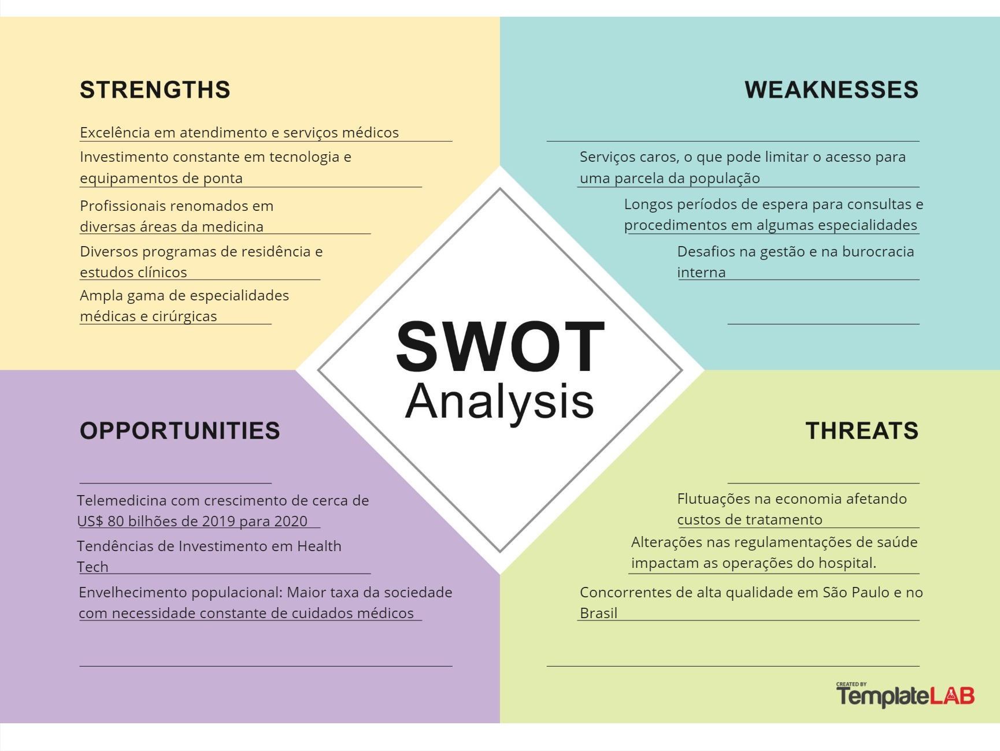
  <p>Fonte: elaborada pelos autores.</p>
</div>

Assim, é recomendável aprofundar nos tópicos mencionados na imagem 01. Com esse objetivo, é importante entender que, na análise, em **forças** e **fraquezas** são considerados aspectos internos e em **oportunidades** e **ameaças**, aspectos externos.

**Forças:**

- Reputação e prestígio o hospital é conhecido por sua excelência em atendimento e serviços médicos.
- Infraestrutura Avançada, o hospital investe constantemente em tecnologia e equipamentos de ponta.
- Equipe de Especialistas contam com profissionais renomados em diversas áreas da medicina.
- Educação e Pesquisa o hospital tem um compromisso com a formação médica e pesquisa, tendo diversos programas de residência e estudos clínicos.
- Diversidade de Especialidades oferecem uma ampla gama de especialidades médicas e cirúrgicas.

**Fraquezas:**

- Custos elevados, os serviços do hospital são conhecidos por serem caros, o que pode limitar o acesso para uma parcela da população.
- Demanda alta, a procura elevada pode resultar em longos períodos de espera para consultas e procedimentos em algumas especialidades.
- Complexidade administrativa, como em muitos grandes hospitais, pode haver desafios na gestão e na burocracia interna.
- Localização centralizada do hospital limita o acesso para quem mora longe, aumentando custos e tempo de viagem, e pode levar à superlotação das instalações.
  

**Oportunidades:**

 - Evolução da Telemedicina: A telemedicina teve crescimento de cerca de US$ 79,79 bilhões de 2019 para 2020, sendo uma área emergente e uma oportunidade para o Hospital Sírio-Libanês.
 - Tendências de Investimento em Health Tech: Crescente de aplicações digitais para melhoria do atendimento médico e qualidade de vida. Dados da Global Market Insights mostram que a tendência mundial aponta para uma movimentação em digital health de US$ 379 bilhões até 2024.
 - Envelhecimento Populacional: O Brasil se encontra na categoria de envelhecimento moderado. Com isso, a área da saúde tem um crescimento devido à necessidade maior de cuidados por parte desse público. 


**Ameaças:**

- Existem outros hospitais de alta qualidade em São Paulo e no Brasil, que podem competir pelo mesmo público-alvo.
- As alterações nas regulamentações de saúde podem impactar as operações do hospital.
- As constantes flutuações na economia podem afetar a capacidade dos pacientes de arcar com os custos do tratamento.
- Questões de segurança relacionadas à segurança do paciente e privacidade dos dados são uma preocupação constante no setor de saúde.

&emsp;&emsp;Então, nesse cenário do fluxo hospitalar, é possível destacar o tópico que aborda as fraquezas dentro do negócio. Isso porque existem soluções possíveis de serem solucionadas por equipes de logística do hospital e podem ser perigosas para o negócio. Portanto, é através desta implementação tecnológica e das ideias abordadas pela *SWOT* que o hospital intensificará sua excelência em atendimento, reiterando sua dedicação à qualidade e ao cuidado de todos os envolvidos.

### 3.1.3. Descrição da Solução a ser Desenvolvida

&emsp;&emsp;O grupo Clepius está trabalhando no desenvolvimento de uma solução baseada em IoT para monitorar em tempo real a identidade, localização e duração da permanência de indivíduos dentro do hospital. Essa iniciativa tem como o objetivo aprimorar o atendimento ao paciente e aumentar a eficácia das equipes de assistência.

#### 3.1.3.1 Qual é o problema a ser resolvido

&emsp;&emsp;O fluxo hospitalar no Pronto Atendimento (PA) do Hospital Sírio Libanês é completo, envolvendo múltiplas etapas e interações entre pacientes e equipes assistenciais. A falta de gestão em tempo real, movimentos e localizações pode levar a ineficiências no atendimento ao paciente e na resposta a situações de emergência. Há a necessidade de rastrear e gerir o fluxo de pacientes e equipes, particularmente em situações onde o paciente está fora da área do PA (como durante exames de imagem) ou em situações críticas que exigem uma resposta rápida da equipe.

#### 3.1.3.2 Qual a solução proposta (visão de negócios)

&emsp;&emsp;A solução proposta aborda o desenvolvimento de uma solução baseada em IoT (Internet das Coisas) de baixo custo que permita identificar e rastrear, em tempo real, a localização de pacientes e equipes assistenciais dentro do PA. Esta solução proporcionaria dados sobre a localização atual, o tempo gasto em cada local e o trajeto das pessoas, permitindo uma gestão mais eficaz do fluxo hospitalar e uma resposta rápida em situações de emergência.

#### 3.1.3.3 Como a solução proposta deverá ser utilizada

- Pacientes: Ao entrar no PA, os pacientes receberão um dispositivo IoT (por exemplo, uma pulseira ou crachá) que rastreará sua localização em tempo real. O sistema monitorará seus movimentos, registrando o tempo gasto em cada área e alertando a equipe caso haja atrasos ou complicações no fluxo.

- Equipes assistenciais: Os membros da equipe também usarão dispositivos semelhantes, permitindo que o sistema rastreie sua localização em tempo real. O IoT indicará quem está mais próximo e disponível para responder a uma situação de emergência, otimizando o tempo de resposta.

#### 3.1.3.4 Quais os benefícios trazidos pela solução proposta

- Otimização do Fluxo: Com a gestão em tempo real, será possível reduzir gargalos e ineficiências, melhorando o fluxo de pacientes e equipes.

- Resposta Rápida em Emergências: Em situações críticas, a equipe pode identificar rapidamente quem está mais próximo e disponível para responder, reduzindo o tempo de resposta.

- Gestão Eficiente: Com dados precisos sobre tempos, movimentos e localizações, a gestão pode tomar decisões informadas para melhorar constantemente o fluxo hospitalar.

#### 3.1.3.5 Qual será o critério de sucesso e qual medida será utilizada para o avaliar

Serão estabelecidos indicadores chave de desempenho como:

- Média de tempo de espera no PA antes e após a implementação da solução.

- Média de tempo de resposta da equipe em situações de emergência antes e após a implementação.

- Taxa de incidentes ou complicações relacionadas a atrasos no fluxo hospitalar.

- Feedback de satisfação de pacientes e equipes sobre a eficiência do fluxo após a implementação.

Esses indicadores ajudarão a avaliar o impacto e a eficácia da solução no aprimoramento do fluxo hospitalar e na resposta a emergências.

&emsp;&emsp;Dessa forma, os objetivos desta proposta concentram-se na otimização do fluxo hospitalar, abordando diversos aspectos relacionados ao controle eficiente do tempo. Isso inclui a mobilização eficaz de pacientes e equipes médicas para lidar com situações de emergência, bem como a melhoria do agendamento de consultas.

### 3.1.4. Value Proposition Canvas
&emsp;&emsp;O Canvas de Proposta de Valor, ou Value Proposition Canvas, é uma ferramenta fundamental no domínio da estratégia de negócios e inovação. Ele foi desenvolvido para auxiliar empresas a entenderem as necessidades e desejos de seus clientes, bem como a criar produtos ou serviços que atendam a essas demandas de forma eficaz. O Canvas de Proposta de Valor é uma extensão do famoso *Business Model Canvas*, e concentra-se especificamente na elaboração de propostas de valor sólidas, as quais são a essência de qualquer negócio bem-sucedido. Ao dividir a análise em dois componentes-chave, o perfil do cliente e a proposta de valor, o Canvas oferece uma estrutura clara que ajuda as empresas a aprimorar seus produtos, definir estratégias de marketing e, em última análise, conquistar a satisfação do cliente e o sucesso nos negócios.

&emsp;&emsp;Para aplicar o Canvas de Proposta de Valor ao projeto de IoT para a gestão de fluxo no Hospital Sírio Libanês, se inicia com a análise do perfil do cliente, que, neste caso, inclui tanto os pacientes quanto a equipe assistencial (profissionais da saúde e da logística hospitalar).  A partir desse ponto, são identificadas suas necessidades e desejos, como a busca por atendimento eficiente, segurança e informações em tempo real. Em seguida, concentra-se na construção da Proposta de Valor, descrevendo como sua solução IoT de baixo custo pode atender a essas necessidades. Então, é destacado como a solução pode melhorar a experiência do paciente e aumentar a eficiência operacional do hospital. Essa abordagem estruturada ajuda a equipe a alinhar o projeto às expectativas e demandas das partes interessadas, permitindo o desenvolvimento de uma solução IoT verdadeiramente valiosa para o Hospital Sírio Libanês. 

<div align="center">
  <p>Imagem 03 - Value Proposition Canvas (Clepius)</p>
  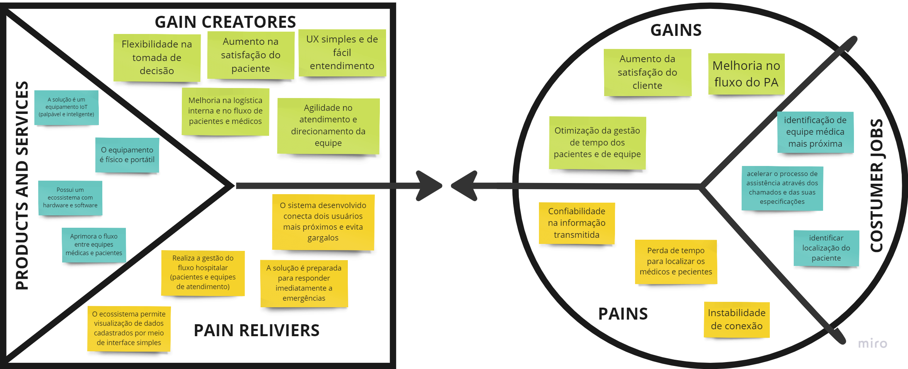
  <p>Fonte: elaborada pelos autores.</p>
</div>

&emsp;&emsp;Nesse cenário, fica evidente a correlação direta entre as dores do cliente e os aliviadores que o projeto visa proporcionar. As dores, como o grande fluxo hospitalar e a dificuldade em identificar previamente a urgência dos pacientes, podem ser substancialmente aliviadas pelos recursos que a solução IoT traz. Dessa maneira, a solução ajudará a identificar a urgência de cada atendimento e melhorará a comunicação em rede integrada para promover uma coordenação mais eficaz da equipe assistencial, agilizando o atendimento. Além disso, a melhoria no controle da localização dos pacientes contribuirá para um fluxo hospitalar mais eficiente, garantindo que os pacientes sejam encaminhados para os locais adequados no momento certo. Em resumo, o projeto se apresenta como uma solução abrangente que não apenas atende, mas alivia de forma eficaz as dores do cliente, transformando a experiência hospitalar para melhor.

### 3.1.5. Matriz de Riscos

&emsp;&emsp;A matriz de riscos é uma ferramenta de análise de negócios que envolve a criação de uma tabela na qual os riscos são listados nas linhas e os impactos e probabilidades são listados nas colunas. As células da matriz são preenchidas com informações que descrevem a gravidade do risco (impacto) e a probabilidade de ocorrência. Isso permite que a organização avalie quais riscos são os mais críticos e onde é necessário dedicar recursos para gerenciá-los.

&emsp;&emsp;A matriz de risco desempenha um papel fundamental ao avaliar e gerenciar riscos em projetos ou implementações. Desse modo, uma matriz bem elaborada possibilita à equipe priorizar os riscos mais críticos, tornando mais fácil a implementação de medidas preventivas e corretivas apropriadas. Desta maneira, os impactos negativos possíveis são reduzidos. Considerando as particularidades da equipe e do projeto em questão, apresento a seguir uma análise de riscos específica para este empreendimento.

&emsp;&emsp;No caso do projeto, essa matriz guia organicamente o grupo Clepius para voltar a atenção em relação a possibilidades de riscos e oportunidades.

<div align="center">
  <p>Imagem 04 - Matriz de Risco para Ameaças e Oportunidades</p>
  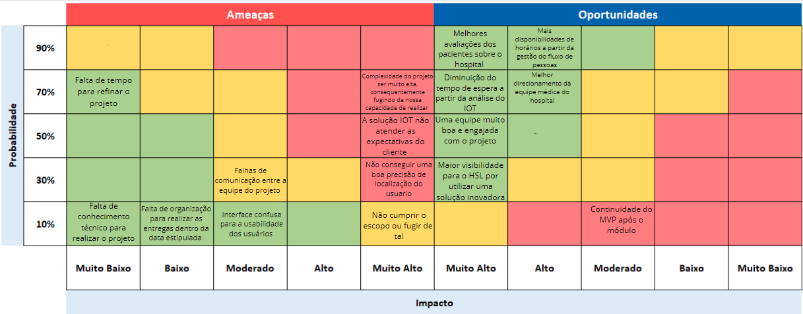
  <p>Fonte: elaborada pelos autores.</p>
</div>

&emsp;&emsp;Com o intuito de melhorar a clareza da imagem, procedemos à transcrição dos textos nela contidos e os estruturamos em tópicos separados, da seguinte maneira:

**Riscos potenciais:**

- Não cumprir o escopo ou fugir de tal (Probabilidade: Muito baixa 10% X Impacto: Muito alto);
- A solução IOT não atender às expectativas do cliente (Probabilidade: Moderada 50% X Impacto: Muito alto);
- Não conseguir uma boa precisão de localização do usuário (Probabilidade: Moderada 30% X Impacto: Muito alto);
- Complexidade do projeto ser muito alta, consequentemente fugindo da capacidade de realizar (Probabilidade: Moderada 70% X Impacto: Muito alto);

**Riscos reais:**

- Falta de tempo para refinar o projeto (Probabilidade: Alta 70% X Impacto: Muito baixo);
- Falta de conhecimento técnico para realizar o projeto (Probabilidade: Baixa 10% X Impacto: Muito baixo);
- Falta de organização para realizar as entregas dentro da data estipulada (Probabilidade: Muita Baixa 10% X Impacto: Baixo);
- Interface confusa para a usabilidade do cliente (Probabilidade: Muita Baixa 10% X Impacto: Moderado);
- Falhas de comunicação entre a equipe do projeto (Probabilidade: Muita Baixa 30% X Impacto: Moderado);

### Plano de ação e resposta para todos os riscos:

**Potenciais:**

- Criar um cronograma realista e atribuir tarefas específicas para a equipe e mantê-la bem atualizada sobre o escopo do projeto e as expectativas do cliente, incentivando a busca por melhorias e aperfeiçoamento contínuo, para que os objetivos sejam alcançados dentro do prazo estabelecido.
- Validar a cada sprint a construção da solução IOT, sempre buscando o aperfeiçoamento de acordo com os feedbacks do cliente, para que assim não haja conflito durante a entrega final do MVP.
- Utilizar as melhores tecnologias e ferramentas dentro do nosso alcance e que caibam no orçamento do projeto, assim, iremos garantir que o sistema de localização tenha uma boa precisão. 
- Sempre que necessário pedir auxílio aos instrutores para conseguir entender e superar os desafios que iremos enfrentar durante o módulo, dessa forma, alcançaremos a conclusão do MVP.

**Reais:**

- Ao não seguir um bom planejamento e se atentar a organização do projeto pode vir a ocorrer a falta de tempo, entretanto, para que isso não seja um problema e não venha a ocorrer, a equipe optou por trabalhar com a metodologia Agile e Kanban, o que permitirá a divisão eficiente das tarefas e sua conclusão dentro do prazo estabelecido.
- Implementar treinamentos técnicos específicos para a equipe visando prevenir lacunas de conhecimento e assegurar a execução eficiente do projeto. Além disso, manter canais abertos de comunicação para identificar e abordar rapidamente qualquer falta de compreensão técnica que possa surgir.
- No início do projeto, é fundamental criar um planejamento básico que aborda apenas o escopo, a fim de evitar frustrar o cliente com quebras de expectativas.
- Além disso, é essencial garantir que a solução IOT seja eficaz e de fácil manuseio para que a pessoa utilize o sistema sem problemas, garantindo assim, a sua eficácia em reduzir o fluxo de pessoas.
- Promover uma cultura de comunicação aberta e honesta, incentivando os membros da equipe a relatarem problemas ou preocupações.
  
**Oportunidades potenciais:**

- Melhores avaliações dos pacientes sobre o hospital (Probabilidade: Muito alta 90% X Impacto: Muito alto)
- Diminuição do tempo de espera a partir da análise do IOT; (Probabilidade: Muito alta 70% X Impacto: Muito alto)
- Maior visibilidade para o HSL por utilizar uma solução inovadora; (Probabilidade: Baixa 30% X Impacto: Muito alto)
- Continuação do MVP após o módulo (Probabilidade: Muito baixa 10% X Impacto: Moderado)
  
**Oportunidades reais:**

- Uma equipe muito boa e engajada com o projeto; (Probabilidade: Moderada 50% X Impacto: Muito alto)
- Mais disponibilidades de horários a partir da gestão do fluxo de pessoas; (Probabilidade: Muito alta 90% X Impacto: Alto)
- Melhor direcionamento da equipe médica do hospital; (Probabilidade: Alta 70% X Impacto: Alto)

### Plano de ação e resposta para todas as oportunidades:

**Potenciais:**

- Otimizando o tempo de espera dos pacientes, eles ficarão mais satisfeitos, resultando em avaliações mais positivas para o hospital, com elogios ao atendimento rápido e tecnológico.
- Ao atender às expectativas do HSL (Hospital Sírio-Libanês) e desenvolver uma solução que indique com precisão a distância dos pacientes até o consultório, o tempo de espera diminuirá devido à maior organização e dinamismo no fluxo de pessoas. Isso assegura qualidade e pontualidade no atendimento ao cliente.
- Caso o MVP atinja as expectativas do cliente e seja implementado de fato no HSL (Hospital Sírio-Libanês), o hospital terá maior visibilidade no mercado por fazer uso de uma solução inovadora e tecnológica.
- Conseguindo atender as expectativas do cliente e atingindo um alto nível de sucesso nos testes, a probabilidade de continuidade da solução IOT é alta.

**Reais:**

- Com uma equipe engajada e autodidata, será possível entregar um produto de alta qualidade e que atende as necessidades do nosso cliente.
- Ao melhorar o algoritmo, a empresa diminuirá o tempo de espera do paciente, o que a permitirá assumir uma posição de destaque frente aos hospitais concorrentes.
- Conseguindo otimizar o fluxo e gestão de pessoas dentro do hospital com a solução IOT, será mais fácil direcionar equipes ou funcionários para determinada tarefa.

&emsp;&emsp;Portanto, a análise detalhada da matriz de risco oferece uma perspectiva valiosa para a gestão eficaz do projeto em parceria com o Hospital Sírio-Libanês. Ao destacar riscos potenciais e oportunidades estratégicas, estamos melhor posicionados para adotar medidas preventivas, superar desafios e otimizar os benefícios ao longo do desenvolvimento do projeto. Essa abordagem proativa não apenas fortalece a resiliência operacional, mas também promove uma colaboração sólida, visando o sucesso duradouro da iniciativa e a criação de valor sustentável para todas as partes envolvidas.

### 3.1.6. Política de Privacidade de acordo com a LGPD	

&emsp;&emsp;A Lei Geral de Proteção de Dados (LGPD) é uma legislação brasileira que estabelece diretrizes para o tratamento de informações pessoais, visando proteger a privacidade e os direitos dos indivíduos. Ela estabelece regras, como a necessidade de pedir permissão antes de usar dados pessoais, tornando tudo mais transparente e exigindo que as organizações protejam bem os dados que têm. Por isso, é fundamental seguir essas regras.

&emsp;&emsp;No contexto do nosso projeto de gestão do fluxo hospitalar com solução IoT, a LGPD é relevante, pois implica a necessidade de garantir a privacidade e segurança dos dados pessoais das pessoas envolvidas, como pacientes e equipe hospitalar. É essencial considerar a conformidade com a LGPD ao implementar sistemas de identificação e rastreamento em tempo real, garantindo que os dados sejam tratados de acordo com as normas legais, o que pode incluir o consentimento adequado quando necessário.  

#### 3.1.6.1 Informações gerais sobre  *stakeholder* Hospital Sírio-Libanês.

&emsp;&emsp;O HSL (Hospital Sírio-Libanês), fundado por imigrantes da comunidade sírio-libanesa em 1921, começou suas operações como uma casa de saúde, e, com o passar do tempo, se consolidou como referência em medicina no Brasil. Ele oferece atendimento em diversas especialidades médicas e também é reconhecido por sua infraestrutura de ponta em termos de tecnologia médica. Além dos serviços médicos, o Sírio-Libanês é um importante centro de ensino e pesquisa no Brasil. Também é frequentemente classificado como um dos melhores da América Latina e possui várias certificações de qualidade, garantindo o alto padrão dos serviços prestados.

#### 3.1.6.2 Informações sobre o tratamento de dados.

&emsp;&emsp;A política do hospital reafirma o compromisso com a segurança, a privacidade e a transparência no tratamento das suas informações. Ela descreve como coletam e tratam os dados quando você acessa no *site*, conforme previsto nos "Termos de Uso". O hospital não registra nenhuma informação pessoal, a não ser que você as forneça voluntariamente por meio do cadastramento no site ou nas suas dependências.

#### 3.1.6.3 Quais são os dados coletados?

Os dados pessoais que são coletados são:

-**Nome Completo:** Para identificação do médico.

-**Especialidade Médica:** Para determinar a área de atuação do médico dentro do hospital.

-**Número de Registro Profissional (como CRM no Brasil):** Isso pode ser usado para fins de autenticação ou verificação.

-**Localização:** Se o dispositivo tiver capacidade de rastreamento, pode coletar dados de localização em tempo real para determinar onde o médico está localizado dentro do hospital.

-**Endereço IP**: Se o pager estiver conectado a uma rede, o endereço IP do dispositivo pode ser coletado para fins de conexão, diagnóstico de problemas de rede ou segurança.

-**Horário de Turno**: Quando o médico começa e termina seu turno, para saber se ele está disponível.

-**Área ou Departamento**: Informação sobre qual departamento ou ala o médico está designado.


#### 3.1.6.4 Onde os dados são coletados?

&emsp;&emsp;Os dados são coletados em duas principais categorias:

- Informações fornecidas pelo Usuário: O Hospital Sírio-Libanês coleta todas as informações inseridas ativamente pelo usuário nas páginas do site, tais como nome completo, e-mail, número de telefone/celular.

- Dados coletados automaticamente: O hospital também coleta uma série de informações de modo automático, tais como características do dispositivo de acesso, IP (com data e hora), origem do IP, informações sobre cliques, páginas acessadas, entre outras informações fornecidas no formulário pelo usuário.

#### 3.1.6.5 Para quais finalidades os dados serão utilizadas?

&emsp;&emsp;Os dados são utilizados para prover os serviços solicitados pelo paciente e o mesmo deve mandar as informações por e-mail sobre produtos e serviços 


>O Hospital diz: "Base Legal: Nestes casos, o tratamento de dados é autorizado pelo inciso I do artigo 7º da Lei nº 13.709/2018, a Lei Geral de Proteção de Dados Pessoais (“LGPD”)."


#### 3.1.6.6 Onde os dados ficam armazenados?

&emsp;&emsp;Os dados coletados podem ser compartilhados com parceiros para fins específicos, incluindo provedores de infraestrutura tecnológica e operacional necessária para as atividades do hospital. Alguns dos parceiros mencionados na política incluem:

**Google (Google Analytics e Firebase)**: Para obter informações estatísticas sobre o uso dos websites.
**Tasy:** Para gestão de dados de saúde.
**Healthshare:** Para armazenamento e gestão de dados e consentimento.
**Carestream:** Para armazenamento de exames de imagem e seus laudos.
**Laboratórios Fleury:** Para armazenamento de exames de imagem e seus laudos.

#### 3.1.6.7 Qual o período de armazenamento dos dados?

&emsp;&emsp;Todos os dados coletados serão excluídos de nossos servidores quando o Usuário assim requisitar ou quando estes não forem mais necessários ou relevantes para oferecermos os nossos serviços

#### 3.1.6.8 Uso de cookies e/ou tecnologias semelhantes.

&emsp;&emsp;O uso de cookies e tecnologias são usadas para o armazenamento dos dados. Sendo assim o paciente poderá desativar tais tecnologias, porém o site poderá funcionar de uma forma pior que o normal. Os cookies usados são os cookies necessários, cookies funcionais e os cookies de marketing.

#### 3.1.6.9 Com quem esses dados são compartilhados?

&emsp;&emsp;Atualmente os dados são compartilhados com os seguintes parceiros:

- Google (Google Analytics e Firebase)<br>
- Tasy<br>
- Healthshare<br>
- Carestream<br>
- Laboratórios Fleury

#### 3.1.6.10 Informações sobre medidas de segurança adotadas pela empresa.

&emsp;&emsp;O HSL utiliza medidas técnicas e organizacionais para assegurar a proteção de suas informações e dados pessoais. As informações serão mantidas em um ambiente operacional seguro que não está acessível ao público em geral. O HSL se empenha em garantir a privacidade dos dados pessoais e outras informações armazenadas, mas não pode oferecer garantia de segurança absoluta. A utilização não autorizada de contas, problemas de hardware ou software, e outros fatores podem potencialmente comprometer a segurança de seus dados pessoais a qualquer momento. Nesse sentido, nenhuma transmissão pela Internet pode ser considerada completamente à prova de falhas.

#### 3.1.6.11 Orientações sobre como a organização atende aos direitos dos usuários.

&emsp;&emsp;O Hospital Sírio-Libanês segue as diretrizes e normativas brasileiras em relação aos direitos dos pacientes. Isso inclui o direito à informação sobre seu estado de saúde, direito à privacidade, direito a um atendimento humanizado e respeitoso, entre outros.
A instituição também segue as normativas referentes à proteção de dados pessoais(LGPD). Assim, os pacientes têm o direito de saber como seus dados são utilizados, podendo requerer acesso, edição, exclusão, entre outros direitos previstos na lei.
Geralmente, os hospitais fornecem informações detalhadas aos pacientes no momento da admissão, e é importante ler todos os documentos fornecidos e fazer perguntas em caso de dúvidas.

#### 3.1.6.12 Informações sobre como o titular de dados pode solicitar e exercer os seus direitos.

&emsp;&emsp;Em cumprimento à regulamentação aplicável, no que diz respeito à proteção de dados pessoais, o HSL respeita e garante ao Usuário a possibilidade de apresentação de solicitações baseadas nos seguintes direitos:

1) A confirmação da existência de tratamento;
2) O acesso aos dados;
3) A correção de dados incompletos, inexatos ou desatualizados
4) A anonimização, bloqueio ou eliminação de dados desnecessários, excessivos ou tratados em desconformidade;
5) A portabilidade de seus dados a outro fornecedor de serviço ou produto, mediante requisição expressa pelo Usuário;
6) A eliminação dos dados tratados com consentimento do Usuário;
7) A obtenção de informações sobre as entidades públicas ou privadas com as quais o HSL compartilhou seus dados;
8) A informação sobre a possibilidade de não fornecer o seu consentimento, bem como de ser informado sobre as consequências, em caso de negativa;
9) A revogação do consentimento.

&emsp;&emsp;Caso necessite de qualquer auxílio para exercer seus direitos, o Usuário poderá entrar em contato com o HSL conforme orientações dispostas nesta Política.

#### 3.1.6.13 Informações de contato do Data Protection Officer (DPO) ou encarregado de proteção de dados da organização.

&emsp;&emsp;As informações de contato do Data Protection Officer (DPO), é o email: dpo.hsl@lbca.com.br. Caso o Usuário identifique ou tome conhecimento de algo que comprometa a segurança dos dados pessoais, o HSL pede que entre em contato por meio desse e-mail

&emsp;&emsp;Portanto, é destacado que a proteção oferecida pelo LGPD é importante para o projeto. Dessa maneira, pode ser destacado o tópico **3.1.6.10**, que permite o entendimento e volta a atenção necessária para sempre manter a manutenção da segurança dos dados em dia. Dessa maneira, é aconselhado estar atualizado em relação às novas tecnologias disponíveis no mercado para  anter boas práticas e contribuir cada vez mais para o setor de saúde.

### 3.1.7. Bill of Material (BOM)

&nbsp;Um documento no formato Bill of Materials (BoM) é um registro detalhado que descreve todos os componentes, peças, materiais e subconjuntos necessários para a fabricação, montagem ou reparo de um projeto. Sua importância se deve a alguns fatores, como, por exemplo, apresenta uma visão geral de como o produto é construído, facilitando a Estruturação do Projeto. Além disso, o BoM também auxilia no gerenciamento de estoque, permitindo que a equipe de compras saiba exatamente quais materiais e quantidades precisam ser adquiridos, evitando estoques desnecessários e, por fim, torna a comunicação entre as partes envolvidas no projeto mais eficiente.

&nbsp;Dessa forma, destaca-se a função de facilitar a comunicação entre partes envolvidas, tendo em vista que é imprescindível manter, de forma plena, a troca de informações. Então, o documento Bill of Materials será utilizado em função de controle, organização e execução eficiente do projeto, trazendo, também, a gestão de custos do dispositivo sendo desenvolvido.

<div align="center">
  <p>Imagem 05 - Template BoM</p>
  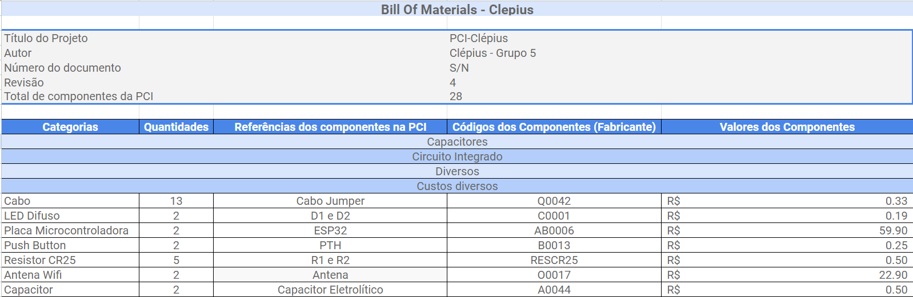
  <p>Fonte: elaborada pelos autores.</p>
</div>

&nbsp;Em sumo, o documento no formato Bill of Materials desempenha um papel central na gestão de projetos de fabricação, montagem ou reparo. Através do BoM, a equipe pode colaborar de forma mais eficaz, evitando a duplicação de esforços e mantendo todos os envolvidos informados. Em última análise, o BoM é uma ferramenta vital para garantir a eficácia, a qualidade e o sucesso de projetos de produção e montagem, desempenhando um papel fundamental na organização e execução eficiente dos mesmos.

## 3.2. Domínio de Fundamentos de Experiência de Usuário

### 3.2.1. Personas

&emsp;&emsp;A persona, um retrato fictício do cliente ideal de um negócio, é elaborada com base em informações e características reais do público-alvo. Essa ferramenta constroi representações fictícias de clientes ideais, baseadas em dados reais e pesquisas com o público-alvo. Elas ajudam a entender melhor as necessidades, dores, objetivos e comportamentos dos usuários finais. 

&emsp;&emsp;Desenvolver personas pode ajudar uma equipe a formular um IoT para o Hospital Sírio-Libanês. Isso porque, ao criar personas, a equipe pode se colocar no lugar dos usuários e criar soluções mais adequadas e personalizadas para eles. Como parte deste projeto, foram desenvolvidas representações visuais ilustrativas de três personas principais identificadas abaixo:

<div align="center">
  <p>Imagem 06 - Persona 01</p>
  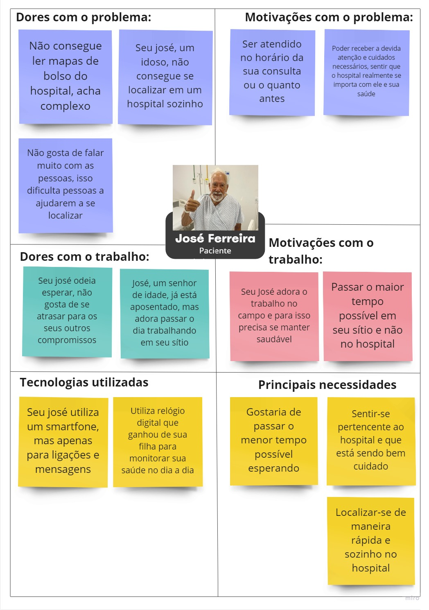
  <p>Fonte: elaborada pelos autores. </p>
</div>

<div align="center">
  <p>Imagem 07 - Persona 02</p>
  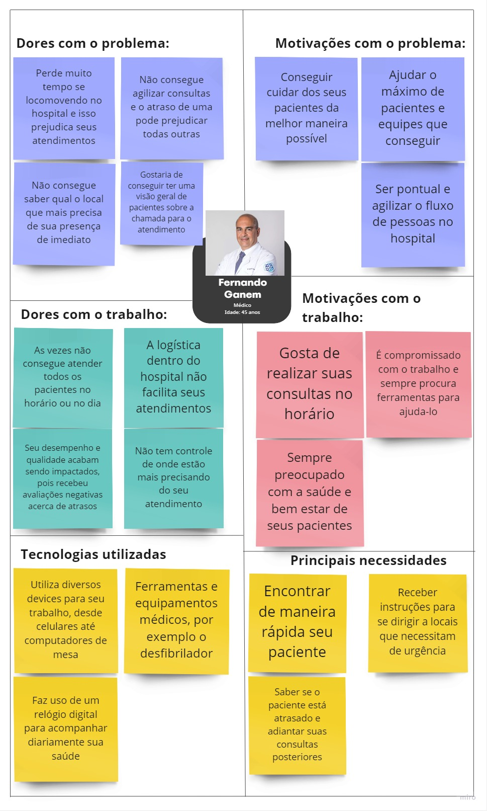
  <p>Fonte: elaborada pelos autores.</p>
</div>

<div align="center">
  <p>Imagem 08 - Persona 03</p>
  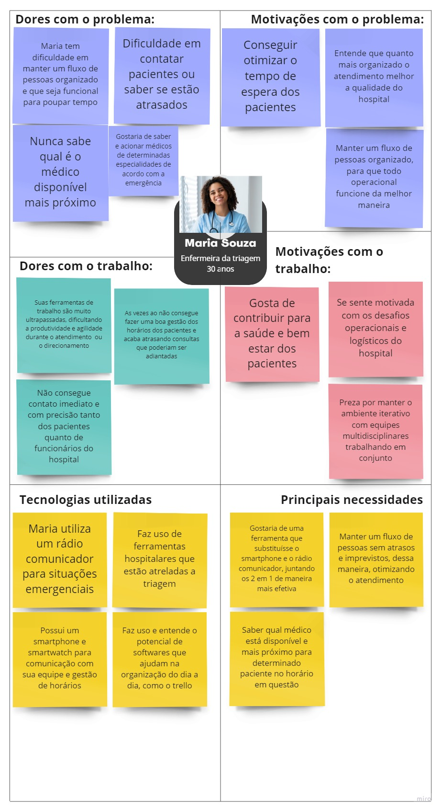
  <p>Fonte: elaborada pelos autores.</p>
</div>

&emsp;&emsp;Em resumo, a criação de personas é mais do que uma simples representação gráfica de usuários; é um processo dinâmico e estratégico que amplia a compreensão das necessidades, expectativas e desafios que nossos clientes enfrentam. Ao desenvolver personas significativas, não apenas moldamos produtos e serviços mais alinhados com as demandas reais, mas também cultivamos uma conexão mais profunda e empática com nosso público.

&emsp;&emsp;Portanto, a construção de personas transcende a esfera do design e se estende a toda a estratégia empresarial, orientando-nos na busca constante pela satisfação do cliente e pela inovação centrada nas pessoas. Dessa maneira, destaca-se o público raiz que vai utilizar a solução: profissionais da saúde, equipes de gestão e pacientes. Com isso em mente, a equipe Clepius pode guiar o desenvolvimento com objetivos claros e palpáveis.

### 3.2.2. Jornadas do Usuário e Storyboard

**Jornadas do Usuário**

&emsp;&emsp; Um mapa de jornada de usuário é uma ferramenta que permite visualizar e entender como um usuário interage com um produto, serviço ou sistema, desde o momento em que ele descobre até o momento em que atinge um objetivo específico. O mapa mostra as etapas, os pontos de contato, as ações, as emoções e as oportunidades de melhoria da experiência do usuário. Ele serve para identificar as necessidades, as dores, os desafios e as expectativas, bem como para criar soluções mais adequadas e personalizadas para eles.

&emsp;&emsp;Essa ferramenta ajuda equipes de tecnologia a desenvolver o IoT para o Hospital Sírio-Libanês, pois permite criar um produto que atenda às expectativas e às necessidades dos usuários finais. Assim, ao usar um mapa de jornada de usuário, a equipe pode entender como o usuário interage com o IoT, quais são os pontos críticos e as oportunidades de melhoria da experiência, e quais são as funcionalidades e os requisitos que o IoT deve ter.

<div align="center">
<p>Imagem 09 - Mapa de jornada do usuário 01</p>

<p>Fonte: elaborada pelos autores.</p>
</div>

<div align="center">
<p>Imagem 10 - Mapa de jornada do usuário 02</p>

<p>Fonte: elaborada pelos autores.</p>
</div>

<div align="center">
<p>Imagem 11 - Mapa de jornada do usuário 03</p>

<p>Fonte: elaborada pelos autores.</p>
</div>

&emsp;&emsp;Portanto, para finalizar essa análise, é importante dar um destaque para as **oportunidades** e **responsabilidades** de cada tipo de usuário. Isso possibilitará a equipe um caminho mais concreto em relação às demandas do projeto.

&emsp;&emsp;
&emsp;&emsp;

**Storyboard**

&emsp;&emsp;Um *storyboard* é uma ferramenta visual utilizada para planejar e organizar uma narrativa, ideia ou processo, por meio de uma sequência de quadros ou imagens acompanhadas de descrições breves. Dessa maneira, cada quadro representa uma etapa ou um momento específico, criando um fluxo lógico e coerente que ajuda na visualização e no entendimento do conceito ou história sendo apresentado. Nesse contexto, os storyboards são amplamente utilizados em diversas áreas, como cinema, design, e desenvolvimento de produtos, servindo como um guia visual para a execução de projetos.

&emsp;&emsp;Nesse quadro, os *storyboards* desenvolvidos evidenciam a aplicabilidade prática da solução IoT em diferentes cenários dentro do hospital. Eles são responsáveis por guiar a equipe que forma o grupo Clepius para entender o uso prático do dispositivo desenvolvido.

&emsp;&emsp;Por conseguinte, é importante definir o que foi desenvolvido nos *storyboards*. Na primeira sequência de quadrinhos, um médico consegue otimizar o seu tempo e atendimento ao ter acesso à localização de seus pacientes. Na segunda, o paciente é atendido, sendo identificado e logo é direcionado ao atendimento necessário. Na terceira, a solução agiliza o processo de identificação e direcionamento dos pacientes, reduzindo tempos de espera e melhorando a eficiência do atendimento inicial.

<div align="center">
<p>Imagem 12 - Storyboard 01 (Médico)</p>
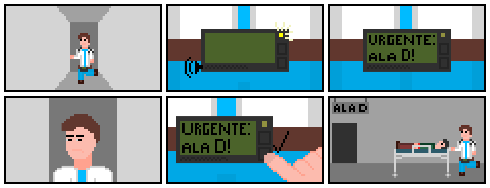
<p>Fonte: elaborada pelos autores.</p>
</div>

**Descrição das cenas:**

**Cena 1:** Um médico que está de plantão na ala de PA está circulando pelos corredores com seu dispositivo IoT na cintura.  
**Cena 2:** O dispositivo apita.  
**Cena 3:** O visor do IoT mostra um chamado com a mensagem "URGENTE: Ala D".  
**Cena 4:** O médico identifica a localização do paciente através do dispositivo.  
**Cena 5:** Então, ele pressiona o botão de confirmar, indicando no sistema que ele irá atender o caso.  
**Cena 6:** O médico corre no sentido da porta marcada "Ala D", com o respectivo paciente deitado em uma maca.

<div align="center">
<p>Imagem 13 - Storyboard 02 (Paciente)</p>
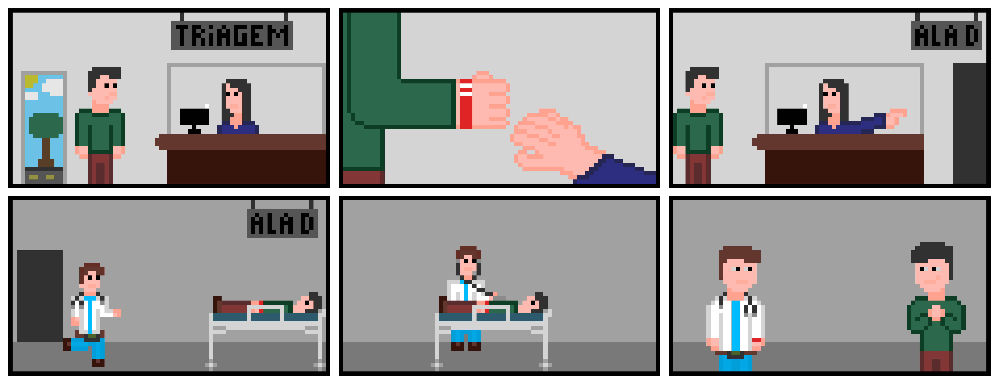
<p>Fonte: elaborada pelos autores.</p>
</div>

**Descrição das cenas:**

**Cena 1:** Um paciente, se sentindo desconfortável e angustiado, se dirige a triagem do hospital.  
**Cena 2:** A enfermeira coloca uma pulseira de identificação com um rastreador no paciente, indicando que sua ficha foi feita.  
**Cena 3:** A enfermeira aponta para uma porta com uma placa "Ala D", indicando ao paciente para onde ele deve ir.  
**Cena 4:** O paciente, deitado em uma maca, olhando a porta, enquanto o médico entra rapidamente.  
**Cena 5:** O médico, com uma expressão calma e atitude profissional, fala com o paciente e começa a examiná-lo.  
**Cena 6:** O paciente, agora mais relaxado, sorrindo e agradecendo ao médico.

<div align="center">
<p>Imagem 14 - Storyboard 03 (Triagem)</p>
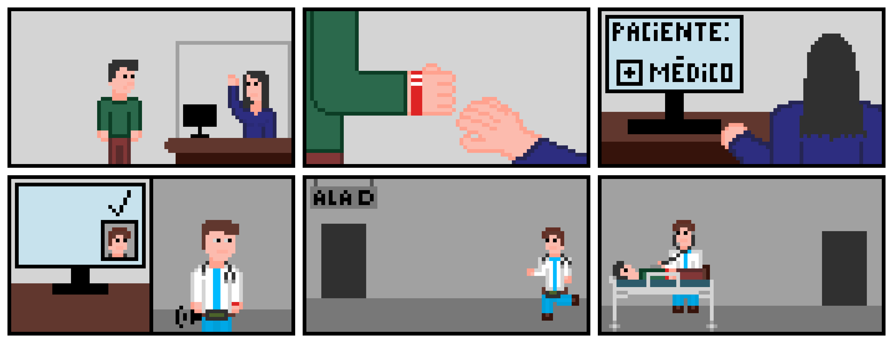
<p>Fonte: elaborada pelos autores.</p>
</div>

**Descrição das cenas:**

**Cena 1:**  Um paciente parado em frente a um balcão, a recepcionista o olha e acena indicando que ela está atendendo.  
**Cena 2:** A recepcionista coloca uma pulseira de identificação no paciente, indicando que sua ficha foi feita.  
**Cena 3:** Agora em frente a um computador, a moça seleciona o nome do paciente e clica em um botão descrito por "Acionar Médico".  
**Cena 4:** A visão do computador mostra uma notificação sendo enviada e o perfil de um médico recebendo a chamada em seu dispositivo IoT.  
**Cena 5:** O médico anda pelo hospital, com facilidade, em direção ao exato local em que o paciente está.  
**Cena 6:** O paciente está deitado na maca, já sendo atendido pelo médico.

&emsp;&emsp;Portanto, com os *storyboards* desenvolvidos, é possível entender a importância da inovação e da tecnologia no setor da saúde. A partir desses cenários representados, o grupo Clepius destaca a importância de se atentar ao contexto do IoT, guiando o desenvolvimento do projeto final para atender as demandas visualizadas nesse método de entendimento do usuário.

&emsp;&emsp;Assim, a proposta para o Hospital Sírio-Libanês tem o potencial de transformar significativamente o cenário atual da instituição, trazendo uma série de benefícios para pacientes, médicos e toda a equipe de assistência.

### 3.2.3. User Stories

 &emsp;&emsp;As *user stories* (histórias de usuário) são componentes importantes para o desenvolvimento de uma solução. Isso acontece porque elas permitem criar empatia pelas personas definidas e ajudam a equipe a entender o que o usuário realmente precisa e por quê. Dessa maneira, direcionam o time para as aplicabilidades reais da solução e tornam palpáveis as ideias que fundamentam o que é esperado como resultado final.

 &emsp;&emsp;Nesse contexto, as *user stories* criadas foram voltadas para o desenvolvimento do projeto de IoT. Elas abordam os cenários em que a solução seria utilizada em ambientes hospitalares e os nichos de usuários para qual esse projeto foi desenvolvido. Além disso, as histórias de usuário contribuem para a validação do sistema, visualizando como os diferentes tipos de pessoas utilizariam a mesma proposta desenvolvida.

<p align="center">
  Tabela 01: Direcionamento pelas áreas do hospital.
</p>

<table>
  <tr>
    <th><strong>Número</strong></th>
    <td>T001</td>
  </tr>
  <tr>
    <th><strong>Título</strong></th>
    <td>Direcionamento pelas áreas do hospital.</td>
  </tr>
  <tr>
    <th><strong>Persona</strong></th>
    <td>Fernando Ganem.</td>
  </tr>
  <tr>
    <th><strong>História</strong></th>
    <td>Como médico, eu quero poder entender em que área do hospital minha presença e ajuda são mais requisitadas para que eu consiga me locomover até o paciente.</td>
  </tr>
  <tr>
    <th><strong>Critério de aceitação<strong></th>
    <td><strong>CR-01 - </strong>
    O sistema deve identificar e realizar o chamado para o médico escolhido.</td>
  </tr>
  <tr>
    <th><strong>Testes de aceitação</strong></th>
    <td>Critério de aceitação: <strong>CR-01</strong>
    <br>
    O sistema realiza o chamado para o médico indicando a localização correta do paciente.<br>
    <br>
    - Conseguiu: correto.<br>
    - Não conseguiu: incorreto, deve ser corrigido.</td>
  </tr>
</table>


<br>
<br>
<br>

<p align="center">
  Tabela 02: Controle de urgência de pacientes.
</p>

<table>
  <tr>
    <th><strong>Número</strong></th>
    <td>T002</td>
  </tr>
  <tr>
    <th><strong>Título</strong></th>
    <td>Controle de urgência de pacientes.</td>
  </tr>
  <tr>
    <th><strong>Persona</strong></th>
    <td>Fernando Ganem.</td>
  </tr>
  <tr>
    <th><strong>História</strong></th>
    <td>Como médico, eu quero poder entender qual paciente deve ser atendido mais rapidamente para que eu consiga auxiliá-los de acordo com suas condições de urgência.</td>
  </tr>
  <tr>
    <th><strong>Critério de aceitação<strong></th>
    <td><strong>CR-01 - </strong>
    O sistema deve elencar os pacientes que necessitam de atendimento de acordo com uma fila de prioridade estabelecida na triagem.
</td>
  </tr>
  <tr>
    <th><strong>Testes de aceitação</strong></th>
    <td>Critério de aceitação: <strong>CR-01</strong><br>
    <br>
    O sistema reconhece dois pacientes com atendimento pendente e diz que Fernando deve ser enviado para o Paciente 1 (Urgente) antes do Paciente 2 (Não urgente).
    <br>
    <br>
    - Aceitou: correto.<br>
    - Não aceitou: incorreto, a ordem de prioridade deve ser corrigida.
    <br>
    <br>
    Ao receber um alerta no dispositivo, consigo ver por meio de texto sobre as condições de prioridade do paciente.
    <br>
    <br>
    - Vejo a informação: Correto.<br>
    - Não vejo a informação: Incorreto, houve inconsistência no cadastro / integração.
    </td>
  </tr>
</table>


<br>
<br>
<br>

<p align="center">
  Tabela 03: Atendimento especializado.
</p>

<table>
  <tr>
    <th><strong>Número</strong></th>
    <td>T003</td>
  </tr>
  <tr>
    <th><strong>Título</strong></th>
    <td>Atendimento especializado.</td>
  </tr>
  <tr>
    <th><strong>Persona</strong></th>
    <td>José Ferreira.</td>
  </tr>
  <tr>
    <th><strong>História</strong></th>
    <td>Como paciente, eu quero ser atendido por um médico especializado na área relacionada à minha condição para que eu possa receber o diagnóstico e tratamento adequado.</td>
  </tr>
  <tr>
    <th><strong>Critério de aceitação<strong></th>
    <td><strong>CR-01 - </strong>
    O sistema deve indicar e conseguir chamar o médico da especialização necessária.
</td>
  </tr>
  <tr>
    <th><strong>Testes de aceitação</strong></th>
    <td>Critério de aceitação: <strong>CR-01</strong><br>
    <br>
    O sistema reconhece os médicos das especializações disponíveis e consegue acioná-los quando necessário.
    <br>
    <br>
    - Conseguiu: correto.<br>
    - Não conseguiu: incorreto, deve ser corrigido.
    </td>
  </tr>
</table>

<br>
<br>
<br>

<p align="center">
  Tabela 04: Abrir chamado de atendimento.
</p>

<table>
  <tr>
    <th><strong>Número</strong></th>
    <td>T004</td>
  </tr>
  <tr>
    <th><strong>Título</strong></th>
    <td>Abrir chamado de atendimento.</td>
  </tr>
  <tr>
    <th><strong>Persona</strong></th>
    <td>Maria Souza.</td>
  </tr>
  <tr>
    <th><strong>História</strong></th>
    <td>Como enfermeira da triagem, quero conseguir abrir chamados para que os pacientes sejam atendidos pelos médicos em um tempo otimizado.</td>
  </tr>
  <tr>
    <th><strong>Critério de aceitação<strong></th>
    <td><strong>CR-01 - </strong>
    O sistema deve permitir que o usuário selecione uma tag de paciente, número e área de atuação de médicos necessários e emitir uma notificação para eles.
</td>
  </tr>
  <tr>
    <th><strong>Testes de aceitação</strong></th>
    <td>Critério de aceitação: <strong>CR-01</strong><br>
    <br>
    O sistema recolhe os dados de input da Maria e notifica a quantidade correta de médicos para o paciente em questão.
    <br>
    <br>
    - Aceitou: correto.<br>
    - Não aceitou: incorreto, deve ser corrigido.
    </td>
  </tr>
</table>


<br>
<br>
<br>

<p align="center">
  Tabela 05: Utilizando o sistema da solução.
</p>

<table>
  <tr>
    <th><strong>Número</strong></th>
    <td>T005</td>
  </tr>
  <tr>
    <th><strong>Título</strong></th>
    <td>Utilizando o sistema da solução.</td>
  </tr>
  <tr>
    <th><strong>Persona</strong></th>
    <td>Maria Souza.</td>
  </tr>
  <tr>
    <th><strong>História</strong></th>
    <td>Como enfermeira da triagem, quero conseguir visualizar quais médicos estão a caminho e quais aceitaram o chamado para que eu tenha uma visão ampla do andamento logístico do hospital.</td>
  </tr>
  <tr>
    <th><strong>Critério de aceitação<strong></th>
    <td><strong>CR-01 - </strong>
    O sistema permite visualizar o nome dos médicos que aceitaram o chamado.
    </td>
  </tr>
  <tr>
    <th><strong>Testes de aceitação</strong></th>
    <td>Critério de aceitação: <strong>CR-01</strong><br>
    <br>
    Com o chamado feito, é possível visualizar quais médicos atenderam ao chamado e o status deles em relação ao atendimento.
    <br>
    <br>
    - Conseguiu visualizar: correto.<br>
    - Não conseguiu visualizar: incorreto, deve ser corrigido.
    </td>
  </tr>
</table>

### 3.2.4. Protótipo de interface com o usuário

**Desenhos Esquemáticos**

&emsp;&emsp;Um desenho esquemático em UX (*User Experience*) refere-se a uma representação visual simplificada de um processo, fluxo de interação, ou interface de usuário. Esses desenhos podem incluir aspectos de usabilidade, wireframes (que serão detalhadas a seguir), protótipos de baixa fidelidade e muitos outros componentes que ajudam a equipe de desenvolvimento ter uma visão ampla sobre o projeto desenvolvido.

&emsp;&emsp;No contexto do desenvolvimento de uma solução IoT no cenário hospitalar, a criação de desenhos esquemáticos em UX desempenha um papel crucial. Essas representações visuais simplificadas oferecem uma visão clara e abrangente dos diversos aspectos da interação do usuário com o sistema.

&emsp;&emsp;Ao elaborar desenhos esquemáticos, a equipe Clepius pode se basear na jornada do usuário, identificar pontos de interação e mapear fluxos de processo, o que facilitou a compreensão da usabilidade da solução.

&emsp;&emsp;Além disso, a inclusão de wireframes e protótipos de baixa fidelidade nos desenhos contribui para a visualização mais precisa da interface e funcionalidades, permitindo ajustes antes da implementação completa. Essa abordagem ajuda a evitar retrabalhos, economizando tempo e recursos durante o ciclo de desenvolvimento.

&emsp;&emsp;É altamente recomendado que o desenho esquemático seja acessado pelo [Figma](https://www.figma.com/file/39bTuteZVC5dNoxvtPMTg3/Prototipagem-R%C3%A1pida?type=design&node-id=0%3A1&mode=design&t=seyqukADfeqRrqgu-1). A seguir, serão detalhadas as diferentes partes que compõe o desenho esquemático da solução:

<div align="center">
<p>Imagem 15 - Desenho Esquemático</p>

<p>Fonte: elaborada pelos autores.</p>
</div>

**CLEP (IoT):**

&emsp;&emsp;É interessante mencionar que o dispositivo a seguir foi desenvolvido com base no storyboard 01, representado na imagem 12 do documento.

<div align="center">
<p>Imagem 16 - "Clep" para times de parada</p>
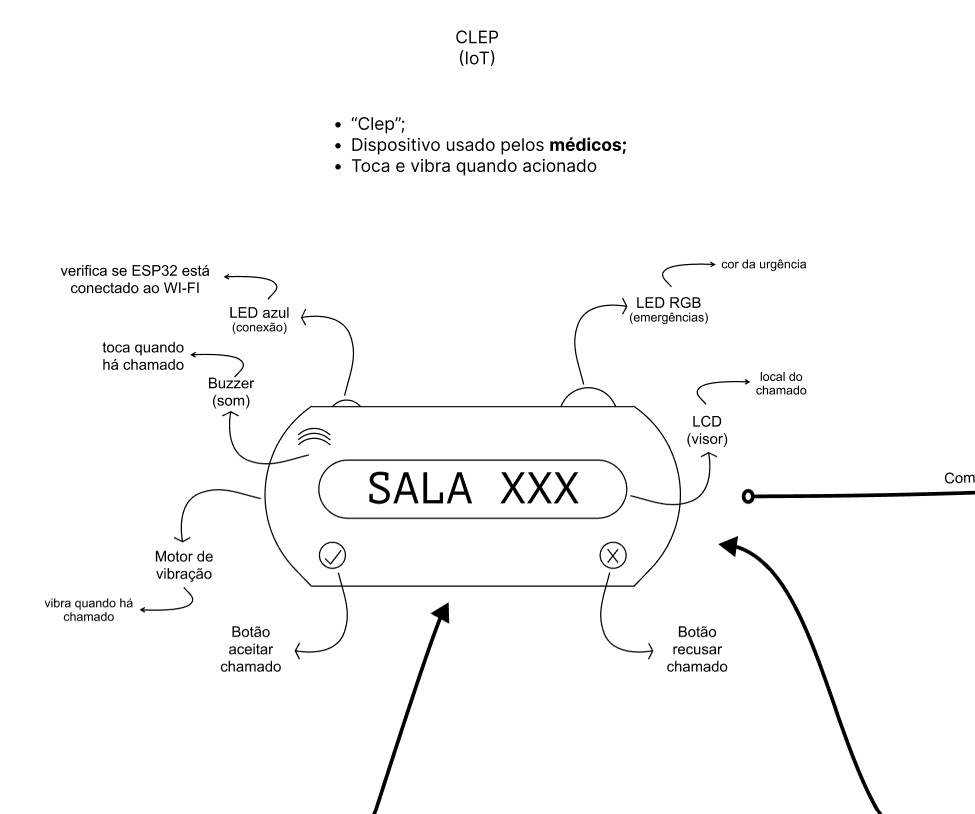
<p>Fonte: elaborada pelos autores.</p>
</div>

&emsp;&emsp;O dispositivo IoT desenvolvido para times de parada compostos por médicos, fisioterapeutas e enfermeiras é portátil e resistente. Ele é formado por uma placa "ESP32" e possui os seguintes componentes:

<div align="center">
<p>Imagem 17 - ESP32 e componentes</p>
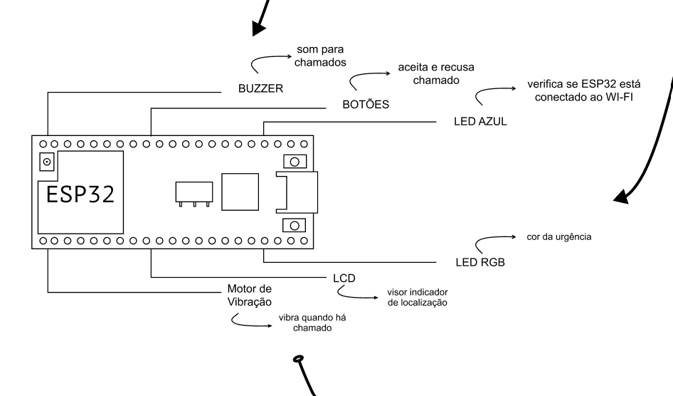
<p>Fonte: elaborada pelos autores.</p>
</div>

&emsp;&emsp;Os itens que compõe o circuito da placa foram delimitados a partir de referências e raciocínios obtidos das user stories e storyboards:

- **LED azul:** mostra para o usuário a conectividade do dispositivo "Clep". O LED pisca quando está apto para ser conectado ao Wi-Fi e fica aceso de maneira constante quando conectado.

- **LED RGB:** mostra para o usuário a categoria da urgência. O LED emite a cor de acordo com a classificação do problema.

- **Buzzer:** emite som quando existe um chamado.

- **Motor de Vibração:** vibra quando há um chamado.

- **Botão "aceitar":** aceita um chamado.

- **Botão "recusar":** recusa um chamado.

- **LCD:** visor que informa ao usuário o local da urgência.

&emsp;&emsp;O IoT "Clep" se conecta a um dashboard que possibilita ao time de logística visializar proficionais de parada, pacientes e status de chamadas, é entre esses dois dispositivos que ocorre a comunicação front-backend por meio de tecnologias definidas nos protocolos específicos de Iot:

<div align="center">
<p>Imagem 18 - Dashboard</p>
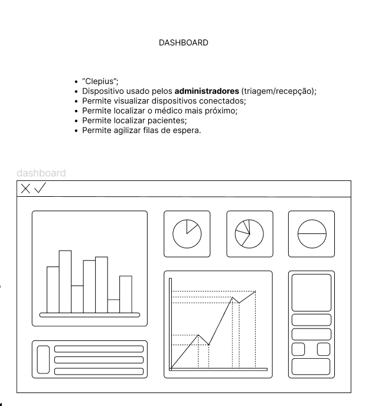
<p>Fonte: elaborada pelos autores.</p>
</div>

&emsp;&emsp;É importante mencionar que, essa parte do projeto, foi desenvolvida com base no storyboard 03, represendato na imagem 14. Além disso, esse mesmo software se conecta aos ESP32 presentes em diferentes ambientes hospitalares:

<div align="center">
<p>Imagem 19 - ESP32 (ambientes hospitalares)</p>
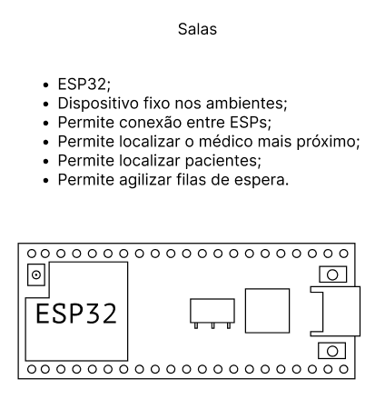
<p>Fonte: elaborada pelos autores.</p>
</div>

&emsp;&emsp;Essas placas permitem observar a dinâmica interna do hospital em relação aos pacientes. É nessa etapa que é possível entender quem está a onde e, por meio disso, manusear a agilidade das filas de espera nos atendimentos.

&emsp;&emsp;Isso é possível por meio da conexão via Wi-Fi entre as diferentes placas de ESP32. Assim, esses mesmos dispositivos (na versão ESP32 mini) estão disponíveis nas pulseiras dos pacientes da seguinte maneira:

<div align="center">
<p>Imagem 20 - Pulseira dos pacientes</p>
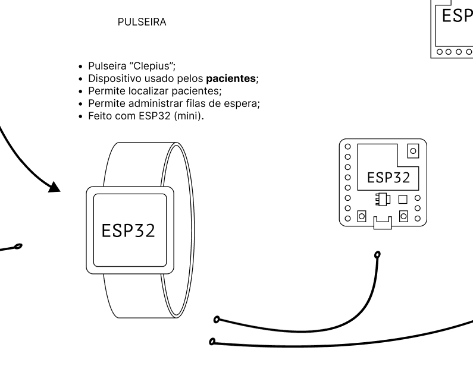
<p>Fonte: elaborada pelos autores.</p>
</div>

&emsp;&emsp;Dessa forma, a disponibilidade de Wi-Fi se torna imprescindível.

<div align="center">
<p>Imagem 20 - Pulseira dos pacientes</p>
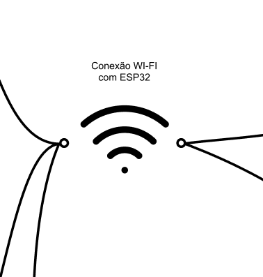
<p>Fonte: elaborada pelos autores.</p>
</div>

***Wireframe***

&emsp;&emsp;Um *wireframe* é uma representação visual básica e esquemática de uma interface de usuário, seja para um site, aplicativo móvel ou outro tipo de sistema digital. Esse conceito é uma ferramenta crucial no processo de design, pois ajuda a estruturar e organizar os elementos fundamentais de uma página ou aplicativo. São geralmente compostos por linhas simples, formas geométricas e ícones, destacando a disposição dos elementos na interface, como botões, campos de texto, imagens e áreas de conteúdo.

&emsp;&emsp;Eles servem como um esboço inicial que permite a visualização da arquitetura da página e compreender a hierarquia de informações e interações. Ao criar um *wireframe*, é possível focar na estrutura e na usabilidade, refinando a experiência do usuário antes de se preocupar com detalhes visuais mais complexos. Isso economiza tempo e esforço, uma vez que mudanças significativas na estrutura podem ser feitas mais facilmente em estágios iniciais do processo de design após ajustadas com o cliente do projeto.

&emsp;&emsp;O sistema "Clepius" foi projetado com uma estrutura de interação que consiste em três telas principais, cada uma abordando aspectos cruciais da história do usuário (definidas no tópico 3.2.3 deste documento) relacionada à triagem de pacientes no ambiente do Hospital Sírio-Libanês. Porém foi escolhido utilizar a plataforma Ubidots, a qual é uma plataforma que facilita a conexão e gerenciamento de dispositivos inteligentes (IoT). Assim, permitiu-se coletar, analisar e visualizar dados de uma variedade de fontes IoT. Dessa maneira, existe este exemplo da solução do projeto realizada no Ubidots.

<div align="center">
<p>Imagem 20 - Pulseira dos pacientes</p>
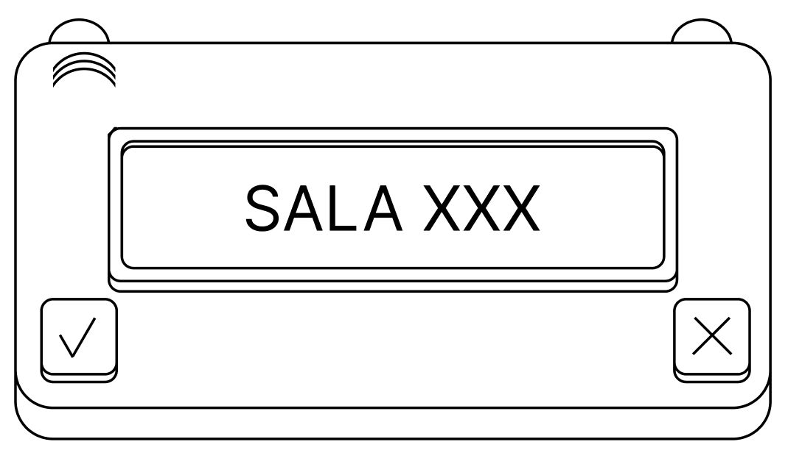
<p>Fonte: elaborada pelos autores.</p>
</div>

&emsp;&emsp;A navegação pelo sistema é facilitada por meio de uma barra lateral proeminente no lado esquerdo do dashboard. Nessa barra, o logo do projeto ocupa uma posição de destaque na parte superior, representando a identidade visual do Clepius. Abaixo, uma lista organizada de páginas navegáveis, composta por 4 seções, oferece acesso fácil e rápido às funcionalidades essenciais do sistema.

&emsp;&emsp;Na extremidade direita, no canto superior, destacam-se o logo do Hospital Sírio-Libanês, cuja identificação é crucial dentro das páginas, e um ícone de usuário. A presença deste ícone de usuário ressalta a necessidade de autenticação para acessar e interagir com o sistema, permitindo visualização de dados e envio de alertas. A tela de login, assim como a de status, não foi incorporada ao wireframe, uma vez que não constitui o ponto focal do projeto, sendo representada apenas por ícone na interface do usuário.

- **Visão Geral**

&emsp;&emsp;Nesta seção, os usuários encontrarão informações fundamentais para o eficiente funcionamento e gestão do sistema. A Visão Geral destaca dados essenciais relacionados à triagem de pacientes, proporcionando uma visão panorâmica das operações do Clepius.

&emsp;&emsp;Os ícones, posicionados logo abaixo do título principal da página, encapsulam as informações cruciais para o usuário. Esses elementos resumem os principais dados, oferecendo uma visão do panorama operacional do Clepius: o número de chamados em aberto, a disponibilidade de médicos e a quantidade de pacientes utilizando o dispositivo de rastreamento. Os alertas gerados pelo sistema, que recebem o nome de "Cleps", conferem uma identidade única e reconhecível ao protótipo. Essa nomenclatura não apenas diferencia os alertas, mas também contribui para a construção de uma marca distintiva.

&emsp;&emsp;Na tabela abaixo, é apresentada uma lista detalhada das pessoas conectadas ao sistema com agrupamento por salas específicas. Assim, a tabela oferece uma visão abrangente da localização de todos os dispositivos dentro do hospital, permitindo a pesquisa, sendo representada por um ícone de lupa dentro do retângulo de input, e filtragens para um mapeamento dinâmico e em tempo real das interações.

&emsp;&emsp;Ao lado, outra tabela chamada “Abrir Cleps” permite a seleção individual de dispositivos pertencentes a pacientes. Esta tabela oferece uma interface simplificada para a modificação da urgência do paciente, possibilitando uma mudança rápida necessária para o envio de alertas dinâmicos. Logo, essa seção possibilita o envio direto de Cleps para médicos próximos, com base na localização específica do dispositivo.

<div align="center">
<p>Imagem 21 - Wireframe da página Visão Geral</p>

<p>Fonte: elaborada pelos autores.</p>
</div>

- **Histórico**

&emsp;&emsp;A página de Histórico desempenha um papel crucial no sistema Clepius, proporcionando aos usuários uma ferramenta valiosa para revisar e analisar chamados antigos. Essa funcionalidade não apenas permite uma visão detalhada das interações passadas, mas também oferece uma oportunidade essencial para análise retrospectiva. Ao possibilitar a revisão de eventos anteriores, os profissionais de saúde e administradores hospitalares podem obter *insights* valiosos, identificar padrões e tendências ao longo do tempo.

<div align="center">
<p>Imagem 22 -     da página Histórico</p>

<p>Fonte: elaborada pelos autores.</p>
</div>	
	
- **Usuários** 

&emsp;&emsp;A seção de Usuários oferece uma gestão detalhada, abrangendo profissionais e pacientes presentes no ambiente hospitalar com dispositivos Clepius. Essa funcionalidade visa facilitar a administração de usuários, garantindo a eficiência e a personalização necessárias para atender às demandas específicas do ambiente hospitalar.

<div align="center">
<p>Imagem 23 - Wireframe da página Usúarios</p>

<p>Fonte: elaborada pelos autores.</p>
</div>

- **Status**

&emsp;&emsp;Embora não haja uma página desenvolvida para o Status nesta versão inicial (MVP), essa seção foi concebida para fornecer uma visualização técnica simplificada. Destinada à gestão do sistema, a página Status ofereceria uma verificação da conectividade geral entre o sistema digital, o banco de dados e a solução IoT, contribuindo para a manutenção e eficiência contínua do Clepius.

&emsp;&emsp;Em conclusão, o uso de wireframes na fase inicial do design é destacado como uma prática fundamental para a definição clara da estrutura e usabilidade do sistema, permitindo ajustes eficientes antes da implementação detalhada. A estrutura de interação do Clepius, delineada através de três telas principais, evidencia a atenção dada a diferentes aspectos da experiência do usuário. A barra lateral de navegação, os ícones representativos e o fluxo de uso demonstram uma consideração meticulosa para garantir uma harmonização entre composição, consistência e continuidade do sistema.


## 3.3. Solução Técnica	

&emsp;&emsp;A "Solução Técnica" é uma abordagem tecnológica estratégica realizada em parceria com a Alma Sírio-Libanês com o objetivo de aprimorar a qualidade e eficiência dos serviços do Hospital Sírio-Libanês. Essa solução envolve a implementação de dispositivos IoT e tecnologias de monitoramento para coletar dados em tempo real em diversas áreas. A colaboração com a Alma Sírio-Libanês, uma instituição de renome na área da saúde, permite a criação de um ambiente hospitalar mais seguro e eficiente, baseado em informações em tempo real e na expertise conjunta de especialistas em saúde e tecnologia.

### 3.3.1. Requisitos Funcionais	

&emsp;&emsp;Os requisitos funcionais são os elementos essenciais para o pleno funcionamento de um sistema, garantindo que ele atenda às necessidades do usuário. Essencialmente, referem-se às capacidades e comportamentos esperados do sistema para a execução eficaz de suas funções.

&emsp;&emsp;No âmbito deste projeto, os requisitos funcionais desempenham um papel crucial ao guiar a produção da solução IoT e sua integração com os serviços web. Sob a visão do "Clepius", a solução visa proporcionar rastreabilidade em tempo real da identidade, localização e duração da permanência de indivíduos dentro do hospital. Diante desse aspecto, a seguir estão os principais requisitos para o projeto: 

**RF1: coleta de dados via sensor.** <br>
&emsp;&emsp;A solução deve possuir a capacidade de identificar a distância entre dois pontos - médico e paciente - por meio de um sensor, podendo ser ultrassônico ou de rede. Ao implementar essa capacidade de coleta de dados, a solução consegue não apenas identificar a localização exata de médicos e pacientes dentro do hospital, mas também calcular a distância relativa entre eles. Isso não só facilita a visualização na interface, como também permite que o sistema forneça orientações sobre o melhor direcionamento a ser adotado. O objetivo é otimizar a alocação de médicos e pacientes, priorizando aqueles que estão mais próximos entre si.

**RF2: Formatação de Dados para Protocolo MQTT** <br>
&emsp;&emsp;Ao assegurar a formatação dos dados para o protocolo MQTT, estabelecemos as conexões entre os dispositivos dos pacientes e médicos. Este protocolo é especialmente vantajoso em ambientes com restrições de recursos, como paredes espessas e grande quantidade de dispositivos, características presentes em um ambiente hospitalar. 
O MQTT opera de maneira assíncrona, permitindo a troca contínua de informações entre os dispositivos, sem interrupções significativas e com baixo delay. Essa característica é essencial para garantir a precisão do aparelho "Clepius" durante seu funcionamento, assegurando que as atualizações sejam transmitidas em tempo real. Além disso, o protocolo MQTT oferece a vantagem de baixa sobrecarga de rede, sendo eficiente para seu propósito no contexto de IoT. Sua natureza leve e o consumo reduzido de recursos tornam-no ideal para a transmissão eficiente de dados, contribuindo para o desempenho eficaz da solução "Clepius" durante o uso no ambiente hospitalar.

**RF3: Conexão Wi-Fi** <br>
&emsp;&emsp;O dispositivo deve ser capaz de se conectar à rede Wi-Fi do hospital, facilitando o envio das informações essenciais para o servidor web e permitindo a visualização destas na interface (frontend). É crucial que essa conexão seja constante e eficaz, pois desempenha um papel fundamental no direcionamento preciso da equipe médica, coordenada pela triagem, de maneira cirúrgica.

**RF4: Definição de Chave de Identificação de Usuário** <br>
&emsp;&emsp;A solução deve ser capaz de carregar dados do usuário, o que implica que cada dispositivo deve passar por um cadastro prévio, tanto para pacientes quanto para médicos. Essa abordagem é crucial para garantir a segurança organizacional da equipe em operação e dos pacientes atendidos no pronto atendimento.
Neste contexto, o cadastro será realizado no próprio dispositivo por meio da interface web do projeto "Clepius", assegurando a criação de uma chave de identificação única para cada usuário do sistema. Isso contribui para a gestão eficiente e segura das interações no ambiente hospitalar.

**RF5: acesso à plataforma web da solução** <br>
&emsp;&emsp;Cada dispositivo deve ser capaz de interagir com a solução web, permitindo o cadastro, atualização e exclusão de status e informações dos usuários do sistema. Nesse contexto, o banco de dados que armazena essas informações deve ser seguro, respeitando as leis de privacidade da solução e garantindo uma conexão eficaz entre o IoT, o banco de dados e a interface web.
Este requisito funcional é essencial para completar o acesso e funcionamento da a plataforma web, possibilitando a execução eficiente de todas as operações necessárias para um trabalho bem-sucedido.

**RF6: definição de devices dentro da plataforma.** <br>
&emsp;&emsp;Os sistemas operacionais dos dispositivos devem ser corretamente integrados e funcionar em suas respectivas funções. Isso é crucial para garantir a eficácia da solução "Clepius". A integração bem-sucedida dos sistemas operacionais é um pré-requisito essencial para o pleno desempenho e interoperabilidade dos dispositivos no ambiente hospitalar.
Além de assegurar o funcionamento adequado de cada dispositivo, a definição precisa dos devices dentro da plataforma contribui para a harmonia do sistema como um todo. Isso inclui não apenas a interconexão entre os dispositivos, mas também a sincronização eficiente de suas funções específicas para atender aos objetivos do projeto "Clepius". Portanto, a definição cuidadosa dessa integração é um passo crucial para a operacionalidade fluida da solução em seu contexto hospitalar.

**RF7: representação gráfica dos dados coletados.** <br>
&emsp;&emsp;Dada a complexidade do sistema e a extensão da área em que a solução Clepius será implementada, torna-se imperativo criar uma representação gráfica dos dados coletados. Isso pode incluir a utilização de mapas ou relatórios com gráficos, proporcionando uma visualização otimizada da localização de cada dispositivo IoT dentro do hospital. Esses relatórios não só abordarão a funcionalidade específica de cada dispositivo, mas também destacarão sua importância estratégica no contexto hospitalar.

&emsp;&emsp;Portanto, ao estabelecer os requisitos funcionais para "Clepius", destacamos a importância de uma interface eficaz para o controle do fluxo de pessoas no hospital. A rastreabilidade em tempo real entre pacientes e funcionários é um diferencial, permitindo uma resposta rápida a situações emergenciais e otimizando o atendimento. Dessa forma, torna-se evidente a necessidade da construção de uma lista com os principais requisitos funcionais para a produção da solução IOT.

### 3.3.2. Requisitos Não Funcionais (RNFs)	

&emsp;&emsp;Os requisitos não funcionais são critérios fundamentais para o funcionamento de um projeto de software, influenciando diretamente na qualidade e no desempenho do sistema. Segundo a norma ISO 25010 [^ISO], os requisitos não funcionais são divididos em oito diferentes grupos principais, cada um cobrindo aspectos específicos que contribuem para a qualidade do software. Esses recursos não funcionais são necessários para garantir a qualidade global de um sistema de software ou produto de sistema.

&emsp;&emsp;Os requisitos não funcionais definidos evidenciam como que cada condição tem sua própria aplicabilidade na solução IoT dentro do funcionamento do projeto de software. Esses requisitos têm o papel de explicar à equipe Clepius o uso das funcionalidades do produto desenvolvido.

[^ISO]: ISO 25010 ― norma internacional que define um conjunto de critérios de qualidade de software e sistemas de software.

**RNF1: eficiência de desempenho.**<br>
&emsp;&emsp;O sistema precisa e ter uma velocidade rápida o suficiente para atualizar a localização dos dispositivos dos médicos e dos pacientes em tempo real e em casos de urgência, conseguir enviar notificações imediatas para os médicos adequados. No entanto, o sistema deve ser otimizado para funcionar, mesmo com muitos dispositivos conectados ao mesmo tempo, de maneira eficiente, sem sobrecarregar a rede ou os servidores.

**RNF2: compatibilidade.**<br>
&emsp;&emsp;Todos os tipos de dispositivos e sistemas operacionais utilizados pelos médicos, pacientes ou equipe de gestão, devem ser capazes de se integrar e comunicar eficientemente entre si. Então, esse requisito não funcional deve assegurar que o sistema funcione de maneira uniforme junto dos outros sistemas em uso no hospital, evitando interferências e conflitos.

**RNF3: usabilidade.**<br>
&emsp;&emsp;As interfaces de usuário devem ser claras e fáceis de serem compreendidas, garantindo que os médicos, pacientes e gestores possam compreender como funciona o sistema. No entanto, os usuários devem ser capazes de compreender de forma rápida como utilizar o sistema e suas funcionalidades, sem a necessidade de um treinamento aprofundado.

**RNF4: confiabilidade.**<br>
&emsp;&emsp;O sistema deve ser caracterizado por sua alta confiabilidade, operando com precisão e correção em suas funcionalidades. Isso inclui manter a integridade e precisão dos dados, mesmo em condições adversas ou em situações críticas. A confiabilidade do sistema é essencial para garantir que ele não falhe ou apresente erros em processos cruciais, como na gestão de emergências médicas e no atendimento ao paciente. Para isso, o sistema deve ser projetado de maneira robusta para minimizar falhas, garantindo operações precisas e corretas consistentemente.

**RNF5: segurança.**<br>
&emsp;&emsp;As informações pessoais dos pacientes e outros dados considerados sensíveis devem ser protegidos, e seriam acessíveis apenas por pessoas ou sistemas autorizados. Assim, os dados armazenados e transmitidos pelo sistema devem ser mantidos íntegros e protegidos contra alterações não autorizadas.

**RNF6: manutenibilidade.**<br>
&emsp;&emsp;A solução deve proporcionar uma fácil manutenção tanto para os usuários finais, quanto para equipes de desenvolvimento que gerenciarão o projeto, permitindo sua evolução e adaptação a novas necessidades e tecnologias. Tendo isso em mente, é necessário garantir que todas as funcionalidades estejam operando corretamente e identificando possíveis falhas.

**RNF7: portabilidade.**<br>
&emsp;&emsp;O sistema deve exibir alta portabilidade, demonstrando sua capacidade de ser adaptado eficazmente a diferentes ambientes tecnológicos e plataformas operacionais. Isso envolve a habilidade do sistema de ser transferido de uma plataforma ou ambiente operacional para outro, como de um sistema operacional para outro ou de uma arquitetura de hardware para outra, com o mínimo de modificações necessárias. A portabilidade do sistema é crucial para garantir sua adaptabilidade a longo prazo, especialmente considerando a evolução contínua da tecnologia no ambiente hospitalar. O sistema deve ser projetado de forma a facilitar essa transição entre diferentes plataformas, assegurando que sua funcionalidade e desempenho sejam mantidos em diferentes configurações tecnológicas.


&emsp;&emsp; Os Requisitos Não Funcionais (RNFs) são cruciais para o sucesso e a sustentabilidade de um sistema de software, como evidenciado pela norma ISO 25010 e aplicado no contexto de gerenciamento hospitalar. Dessa maneira, os destaques no cenário hospitalar são: a compatibilidade com outros sistemas e a confiabilidade em situações críticas, bem como a segurança de dados sensíveis. Esses requisitos garantem que o sistema não apenas atenda às necessidades funcionais imediatas, mas também opere de forma eficiente, segura e adaptável ao longo do tempo, em um ambiente tecnológico em constante evolução.

&emsp;&emsp; Assim, é possível entender a necessidade de uma atenção cuidadosa aos RNFs durante as fases de planejamento e desenvolvimento de um projeto de software. Isso porque, é determinante para a qualidade e eficácia do produto final. Os RNFs influenciam diretamente na satisfação do usuário e na integridade operacional do sistema, sendo componentes essenciais para a entrega de um sistema de software que seja não apenas funcional, mas também robusto, seguro e capaz de evoluir com as demandas do usuário e mudanças tecnológicas.

### 3.3.4. Arquitetura da Solução

Para assistir o vídeo explicativo clique <a href="https://www.youtube.com/watch?v=FFp4qoCmZzE">aqui</a>.

&emsp;&emsp;Um diagrama de arquitetura é um mecanismo de compreenção da solução. Nesse sentido, é possível ter controle e visão de todo o projeto, um "olhar por cima" de todas as partes que compõe um ecossistema e suas interconexões. Ele serve como uma representação visual abrangente da estrutura e organização do sistema, destacando componentes-chave, seus relacionamentos e a maneira como interagem entre si. Além disso, ele permite uma comunicação mais eficaz entre os membros da equipe e **stakeholders** (Hospitál Sírio-Libanês), pois oferece uma linguagem visual comum para discutir a complexidade do sistema. 

&emsp;&emsp;No âmbito da implementação de uma solução IoT para o Hospital Sírio-Libanês, um diagrama de arquitetura agnóstica a tecnologia desempenha um papel crucial ao permitir esse olhar sobre toda a solução e abordar tanto requisitos funcionais quanto requisitos não funcionais. Essa representação destaca os principais componentes e suas interações e delineia como os dispositivos médicos coletam, processam e compartilham dados, proporcionando uma compreensão visual das funcionalidades operacionais essenciais para o bom funcionamento da solução. Ao mesmo tempo, aborda requisitos não funcionais, como confiabilidade, segurança e portabilidade, ao esboçar os protocolos de comuniação e as interfaces de usuário de maneira que facilita a compreensão e comunicação entre os membros da equipe "Clepius".

&emsp;&emsp;O diagrama de arquitetura a seguir representa a visão geral definida. Ainda sim, as partes que compõe esse diagrama serão aprofundadas.

<div align="center">
<p>Imagem 24 - Arquitetura da solução</p>
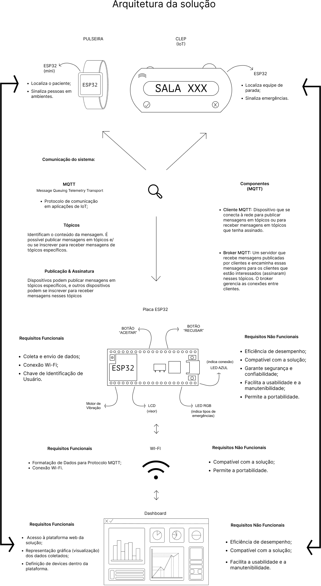
<p>Fonte: elaborada pelos autores.</p>
</div>

### Equipamentos IoT

<div align="center">
<p>Imagem 25 - Equipamentos IoT</p>
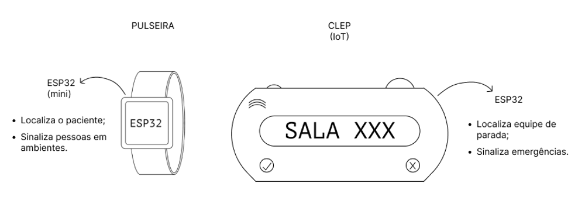
<p>Fonte: elaborada pelos autores.</p>
</div>

&emsp;&emsp;Os equipamentos IoT são como o coração da solução. Essa é uma das interfaces de contato direto com o usuário final e é a partir deles que o ciclo de transporte de informações e dados se inicia e é realizada a comunicação do sistema. Eles são portáteis e de fácil mauseio, agregam tanto para a qualidade quanto para a funcionabiolidade do ecossistema.

### Comunicação do sistema

<div align="center">
<p>Imagem 26 - Comunicação do Sistema</p>
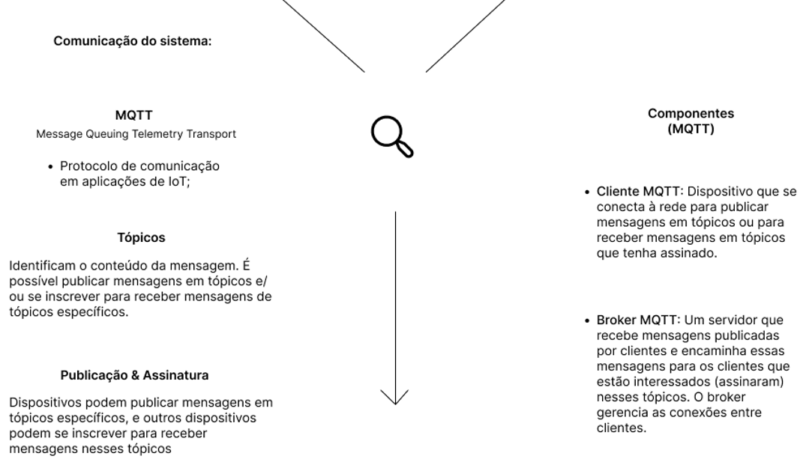
<p>Fonte: elaborada pelos autores.</p>
</div>

&emsp;&emsp;Essa comunicação é viável segundo o protocolo MQTT, que é detalhado na seção 3.4.3. deste documento. Esse protocolo padrão de comunicação IoT apresenta canais de comunicação chamados de "Tópicos", onde são registradas informações sobre cada determinado paciente.

&emsp;&emsp;Esse tópico é usado para a publicação de informações e a assinatura desses tópicos permite que outros dispositivos tenham acesso a informação registrada. Esses dispositivos que realizam essas operações de publicar ou assinar tópicos são chamados de "Clientes".

&emsp;&emsp;Ao mesmo tempo, quem gerencia todo esse ecossistema é chamado de "Broker". Aqui são realizadas todas as operações descritas, incluindo os tópicos, as publicações, assinaturas e os componentes do sistema

&emsp;&emsp;Dessa maneira, os dispositovos IoT podem publicar mensagens nesses canais e acompanhar canais para o fluxo de informações dentro do sistema. 

Assim, o software pode suportar as diferentes requisições do sistema sem prejudicar a segurança das informações (garantindo um requisito funcional e não funcional do projeto).

### Placa ESP32

<div align="center">
<p>Imagem 27 - Placa ESP32</p>
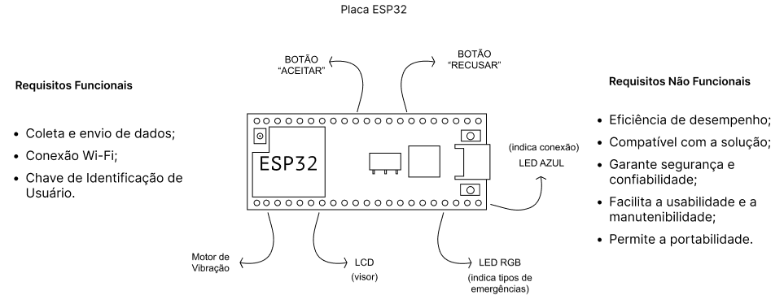
<p>Fonte: elaborada pelos autores.</p>
</div>

&emsp;&emsp;A  placa ESP32  é como o esqueleto do equipamento IoT, ela é o responsável pela parte de lógica de programação do projeto. Nela são gravadas os códigos que fazem a coleta, o registro, o transporte e o gerenciamento de requisições do sistema. Aqui são controlados os componentes que tornam a experiência do usuário possível, como botões, leds, o visor e o motor de vibração.

&emsp;&emsp;É interessante relembrar que s itens que compõe o circuito da placa foram delimitados a partir de referências e raciocínios obtidos das user stories e storyboards, são eles:

- **LED azul:** mostra para o usuário a conectividade do dispositivo "Clep". O LED pisca quando está apto para ser conectado ao Wi-Fi e fica aceso de maneira constante quando conectado.

- **LED RGB:** mostra para o usuário a categoria da urgência. O LED emite a cor de acordo com a classificação do problema.

- **Motor de Vibração:** vibra quando há um chamado.

- **Botão "aceitar":** aceita um chamado.

- **Botão "recusar":** recusa um chamado.

- **LCD:** visor que informa ao usuário o local da urgência.

### Conectividade WiFi

<div align="center">
<p>Imagem 28 - WiFi</p>
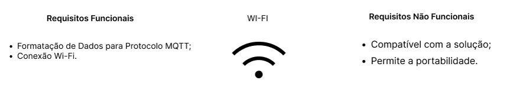
<p>Fonte: elaborada pelos autores.</p>
</div>

&emsp;&emsp; Os requisitos de wifi são cruciais para a funcionalidade e segurança do sistema. Ele pertmite a comunicação entre diferentes pontos presentes na arquitetura e auxilia a relação software/hardware. Além disso, O MQTT promove o funcionamento do fluxo, ou seja, quando um dispositivo captura uma localização e direciona essa informação para a interface com o usuário, o wifi é o mediator entre esse eles. Portanto, o wifi é adequado para o escopo do projeto porque garante o manuseio do IoT para as personas definidas.

### Interface do Usuário (Dashborad)

<div align="center">
<p>Imagem 29 - Dashboard</p>
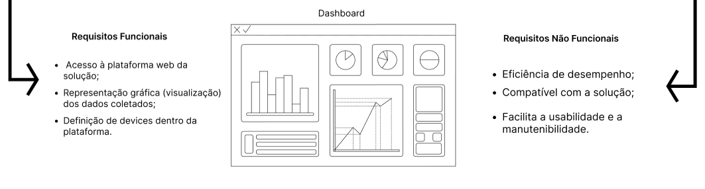
<p>Fonte: elaborada pelos autores.</p>
</div>

&emsp;&emsp; No escopo do projeto, a interface do usuário é de suma importância. Isso acontece porque ela garante que os dados que são capturados pelo IoT e transmitidos por meio do protocólo MQTT sejam visualizados de forma concisa e clara pelo usuário final do dashboard. Da mesma maneira, os dados trafegam de maneira inversa, ou seja, caso seja necessário acionar um IoT é possível realizar essa ação por meio dessa parte da solução.

&emsp;&emsp; Nessa etapa serão apresentados no sistema: localização de pacientes e equipes de parada, disponibilidade e ocupação de agentes hospitarales e placas de ESP32 disponíveis pelo hospital (que ajudarão no alinhamento de filas de espera).

&emsp;&emsp;Em suma, o uso de diagramas de arquitetura é fundamental para a compreensão e gestão eficientes de projetos complexos. Ao proporcionar uma visão global e destacar as interconexões vitais dentro de um ecossistema, esses diagramas não apenas facilitam o controle, mas também promovem uma comunicação mais eficaz entre todas as partes envolvidas. A representação visual oferecida por esses diagramas não só simplifica a discussão da complexidade do sistema, como também estabelece uma linguagem comum, como evidenciado pelo Hospital Sírio-Libanês, destacando sua importância em diversos contextos e setores.

### 3.3.5. Arquitetura do Protótipo

&emsp;&emsp; A arquitetura do projeto pode ser complementada em relação a quinta visão arquitetural em sistemas de Internet das Coisas (IoT). Nesse sentido, essa representação da solução representa uma abordagem holística e avançada para a construção de sistemas IoT.

&emsp;&emsp;Assim, o projeto incorpora uma gama de tecnologias-chave já utilizadas no ambiente tecnológico atual, como a seleção de um hardware eficiente e durável, que reflete a tendência atual de utilizar microcontroladores e sensores de baixo consumo, como os da série ESP32, que são pequenos, eficientes e capazes de funcionar por longos períodos com baterias. Da mesma maneira, foram utilizados protocolos de comunicação avançados, como MQTT (Message Queuing Telemetry Transport), são amplamente utilizados em sistemas IoT para comunicação eficiente e segura entre dispositivos e plataformas.

&emsp;&emsp;Nesse cenário, no contexto do Modelo de *Referência para Open Distributed Processing* (RM-ODP), a infraestrutura para o sistema distribuído proposto abrange diversos elementos essenciais. A conexão Wi-Fi e a utilização do protocolo MQTT são parte integrante da infraestrutura de rede, permitindo a comunicação assíncrona entre dispositivos ESP32 e o servidor MQTT, como o Ubidots. Além disso, a comunicação local entre os ESP32s é estabelecida por meio da biblioteca ESP Now, utilizando callbacks para lidar com eventos e respostas assíncronas.

&emsp;&emsp;Além disso, os componentes físicos desempenham papéis específicos na infraestrutura. Os LEDs, incluindo o azul para indicar conectividade e o RGB para sinalizar a urgência, são considerados dispositivos de saída, controlados pelo sistema presente nas placas ESP32. O motor de vibração, classificado como um atuador, é ativado para gerar vibrações em situações de chamado. Por outro lado, os botões "Aceitar" e "Recusar", sendo dispositivos de entrada, desencadeiam eventos no sistema.

&emsp;&emsp;Por fim, o LCD é um dispositivo de saída utilizado para exibir informações sobre a localização da urgência. A infraestrutura deve suportar a transmissão eficaz de comandos ou mensagens para o LCD. Em resumo, a Visão de Infraestrutura no RM-ODP envolve a configuração, gestão e controle de recursos físicos, redes, protocolos de comunicação e demais elementos cruciais, assegurando o adequado funcionamento do sistema distribuído proposto para monitoramento e resposta a chamados.

&emsp;&emsp;Portanto, a Quinta Visão não é apenas um oconceito teórico, mas uma realidade prática, incorporando e expandindo sobre as tecnologias que já usamos pois ela orienta a criação de sistemas IoT mais eficientes, seguros e adaptáveis, que estão em constante evolução com as tendências tecnológicas emergentes.

<div align="center">
<p>Imagem 28 - Arquitetura em Blocos</p>
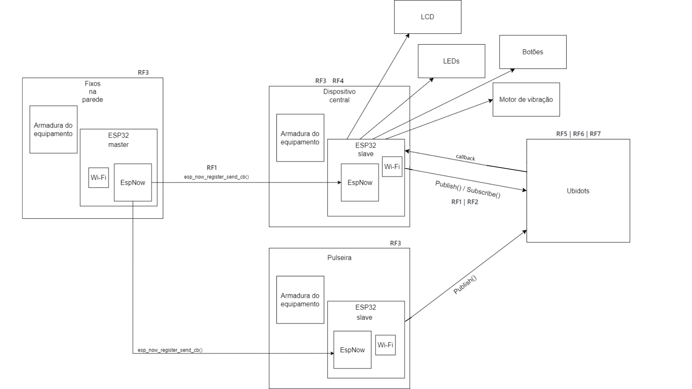
<p>Fonte: elaborada pelos autores.</p>
</div>

Para assistir o vídeo explicativo clique <a href="https://www.youtube.com/watch?v=JLY5ezDcvek">aqui</a>.

&emsp;&emsp;A arquitetura eletrônica proposta para o sistema em questão demanda uma cuidadosa seleção de componentes para garantir seu funcionamento eficiente. A seguir, apresenta-se uma tabela contendo os possíveis componentes a serem empregados com o intuito de oferecer uma visão abrangente e organizada dos elementos cruciais dessa arquitetura. Cada componente desempenha um papel específico na operação do sistema, desde o processamento de dados até a transmissão via Wi-Fi e a interface de usuário. Portanto, esta tabela visa fornecer uma referência concisa e informativa para facilitar o entendimento e a implementação da arquitetura proposta.

| **Componente** | **Descrição** | **Tipo** | 
|----------|----------|----------|
| ESP32 | Processa e transmite os dados enviados pela rede de Wi-Fi | Microcontrolador |
| JUMPERS M/M | Conectores macho-macho utilizados para estabelecer conexões temporárias entre componentes eletrônicos | Jumper |
| JUMPERS M/F | Conectores macho-fêmea utilizados para estabelecer conexões temporárias entre componentes eletrônicos | Jumper |
| LED AZUL | Diodo emissor de luz na cor azul, utilizado para indicar status ou realizar funções específicas | LED |
| LED RGB | Diodo emissor de luz com capacidade de exibir diversas cores, usado para indicar status ou propósitos decorativos | LED |
| VISOR LCD | Display de Cristal Líquido que apresenta informações visuais, geralmente alfanuméricas ou gráficas | Apresentada as informação | Visor |
| CAPACITOR | Dispositivo de armazenamento de carga elétrica, usado para estabilizar tensões ou filtrar sinais | Capacitor |
| RESISTOR | 	Componente eletrônico que limita a corrente elétrica em um circuito, controlando a quantidade de corrente que flui | Capacitor |
| ANTENA | Amplifica o sinal Wi-Fi do ESP-32, melhorando a eficiência da comunicação sem fio | Antena |
| BOTÕES | 	Interruptores utilizados para acionar funções específicas no circuito, como controle de entrada ou seleção de modo | Botão |

### 3.3.6. Arquitetura Refinada da Solução 

&emsp;&emsp;O preenchimento desta seção refere-se aos ajustes da seção 3.3.5. Como não há mudanças a serem realizadas em nossa arquitetura, o preenchimento desta seção não é necessário. Pode-se considerar a arquitetura final como descrita na seção 3.3.5.


## 3.4. Resultados	

_Nesta seção, detalhe os resultados obtidos com a implementação, de acordo com o disposto nas subseções._

### 3.4.1.Protótipo Inicial do Projeto usando o Simulador Wokwi

&emsp;&emsp;Para acessar o protótipo inicial, <a href="https://wokwi.com/projects/379586862326983681">clique aqui</a>.

&emsp;&emsp;Um protótipo de solução refere-se a uma versão preliminar e funcional de um sistema, desenvolvido para validar conceitos, testar funcionalidades, coletar feedback e demonstrar a viabilidade de uma ideia ou projeto. É uma etapa crucial no ciclo de desenvolvimento, visto que ajuda a equipe de desenvolvimento a compreender os requisitos e desafios do projeto, bem como a comunicação com os stakeholders.

&emsp;&emsp;O objetivo principal de criar um protótipo de solução é visualizar e validar a funcionalidade-chave do sistema ou do software antes de prosseguir com o desenvolvimento completo. Isso ajuda a reduzir riscos, economizar tempo e recursos. Se concentram nas funcionalidades críticas ou naquelas que precisam ser validadas, sendo desenvolvidos de forma iterativa, o que significa que eles podem passar por várias iterações para refinamento e melhoria com base no feedback recebido.

&emsp;&emsp;Portanto, em relação ao projeto para a Alma Sírio-Libanês, onde todos os pontos desde o design até funcionalidades devem ser pensados especificamente para a área hospitalar e suas particularidades, o protótipo da solução IoT é uma ferramenta valiosa que auxilia no desenvolvimento dos sistemas e componentes utilizados no decorrer do projeto, permitindo a validação de conceitos com o cliente, testes e a obtenção de feedback antes de se comprometer totalmente com o desenvolvimento do produto final.

<div align="center">
<p>Imagem 18 - Tela inicial do Wokwi</p>
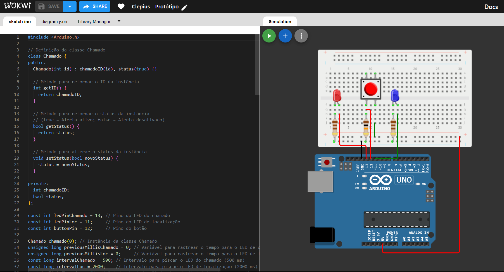
<p>Fonte: elaborada pelos autores.</p>
</div>


**Visão Geral:** <br>
&emsp;&emsp;Clepius foi desenvolvido pensando nas suas duas principais funcionalidades: o rastreamento de médicos e pacientes e a facilidade de envio e resposta de chamados. Nesse contexto, a experiência do usuário está em primeiro plano, garantindo que a plataforma atenda aos requisitos de sucesso de maneira eficaz para todas as personas desenvolvidas. 

&emsp;&emsp;Para a criação, foi utilizada a plataforma Wokwi, que oferece um ambiente virtual de simulação e prototipagem para projetos de hardware. A aplicação oferece uma vasta gama de componentes eletrônicos e microcontroladores populares, juntamente com a capacidade de escrever e depurar código em linguagens como C++.

&emsp;&emsp;O protótipo conta três componentes ativos em seu circuito: um LED vermelho conectado à porta 13 do Arduino, um LED azul ligado à porta 11 do Arduino e um botão de pressão conectado à porta 12 do Arduino, todos funcionando como atuadores. Para garantir o correto funcionamento, foram incluídos dois resistores de 110 Ω para os LEDs e um resistor de 10 kΩ para o botão.

&emsp;&emsp;O código da solução é composto basicamente por 1 classe e 5 funções, contando com a função “setup()” e “loop()”, sendo estas:

**- Classe "Chamado":** é uma estrutura que define o conceito de um chamado no sistema. Ela contém dois atributos principais: um ID que identifica exclusivamente cada chamado e um status que indica se o chamado está ativo ou foi respondido. A classe permite a criação e gerenciamento de instâncias individuais de chamados com essas características.

**- Função Setup:** é executada uma vez no início do programa. Ela configura o ambiente do sistema, especificamente os pinos usados para controlar LEDs e um botão. Além disso, inicia a comunicação serial, que é uma maneira de trocar informações com o computador hospedeiro ou outro dispositivo. Por fim, ela exibe uma mensagem inicial no monitor serial, indicando que o sistema está pronto para funcionar.

**- Função "verificarBotao":** é responsável por monitorar o estado do botão físico. Quando o botão é pressionado (no estado HIGH), essa função é acionada. Ela atua desligando o chamado atual e seu indicador visual, o LED vermelho, indicando que o chamado foi respondido com sucesso. Além disso, mensagens são exibidas no monitor serial para informar o usuário que o chamado foi atendido e que ele pode abrir um novo chamado.

**- Função "emitirAlerta":** tem a tarefa de controlar o LED vermelho, que atua como um indicador visual para indicar a presença de um chamado ativo. O LED pisca intermitentemente a cada 500 milissegundos, fornecendo uma representação visual clara de que um chamado está em andamento.

**- Função "obterLocalizacao":** é responsável pelo controle do LED azul, que simula a obtenção constante da localização do chamado. O LED azul pisca a cada 2 segundos, indicando que o sistema está constantemente atualizando a localização do chamado. Além disso, uma mensagem é exibida no monitor serial para indicar que a localização foi obtida.

**- Função "loop":** É executada continuamente. Ela monitora o status do chamado e, se estiver ativo, chama as funções "verificarBotao" e "emitirAlerta". Além disso, a função "obterLocalizacao" é chamada para garantir que a obtenção da localização seja simulada de forma constante. A função também lê dados da porta serial, onde o usuário pode inserir informações para criar ou atualizar chamados. Quando novos chamados são criados, suas informações são exibidas no monitor serial.

&emsp;&emsp;A seguir, serão abordadas de forma mais detalhada cada funcionalidade do protótipo.


**#** | **Bloco** | **Componente de entrada** | **Leitura da entrada** | **Componente de saída** | **Leitura da saída** | **Descrição**
|----------|----------|----------|----------|----------|----------|----------|
|01|Envio de alerta de emergência|Monitor Serial*| Input int ID | Monitor Serial | Mensagem de confirmação | Ao enviar um número no Serial, que representa um ID, uma mensagem de confirmação de criação e envio de chamado aparece. Esse bloco representa a persona Maria Souza, enfermeira da triagem
|02|Recebimento de alerta de emergência|Botão (push button) vermelho usado para interagir com o chamado.| HIGH / LOW | LED vermelho | LED vermelho piscante em intervalo de 500 milissegundos ou apagado | Ao receber um chamado, o LED vermelho pisca intervaladamente. Ao apertar o botão, o LED é apagado e uma mensagem de “Chamado Respondido” é retornada. Esse bloco representa a persona Fernando Ganem, médico do Hospital Sírio-Libanês. 
|03|Rastreamento de usuário| - | - | LED azul | LED azul piscante em um intervalo de 2000 milissegundos | Constantemente, o LED azul pisca e uma mensagem é retornada pelo Serial: “Localização Obtida”. A saída simula um retorno visual de que a localização do médico/paciente está sendo atualizada com sucesso. Esse bloco representa as personas Fernando Ganem, médico do Sírio-Libanês, e José Ferreira, paciente do hospital.

\* O monitor serial não é um componente, mas uma ferramenta do Arduino. Entretanto, foi utilizado para simular a entrada de dados no protótipo.
<br>
<br> 

**Envio e recebimento de alerta de emergência:** <br>

No início do programa, foi definida uma classe chamada "Chamado". Esta classe é responsável por criar instâncias individuais de chamados, cada uma com seu próprio ID e status. A ideia é que cada instância represente um chamado de emergência específico, sendo direcionada para a solução de um médico específico.

```C++
// Definição da classe Chamado
class Chamado {
public:
  Chamado(int id) : chamadoID(id), status(true) {}

  // Método para retornar o ID da instância
  int getID() {
    return chamadoID;
  }

  // Método para retornar o status da instância
  // (true = Alerta ativo; false = Alerta desativado)
  bool getStatus() {
    return status;
  }

  // Método para alterar o status da instância
  void setStatus(bool novoStatus) {
    status = novoStatus;
  }

private:
  int chamadoID;
  bool status;
};

```

&emsp;&emsp;Para interagir com o sistema, utilizamos um botão físico e dois LEDs. O botão desempenha o papel de permitir a resposta a um chamado. Quando o botão é pressionado, ele funciona como um meio de indicar que o chamado foi atendido. Isso resulta na alteração do status do chamado para "respondido" e, ao mesmo tempo, desliga o LED vermelho associado a esse chamado. O LED vermelho é aquele que pisca intermitentemente para sinalizar a existência de um chamado ativo em andamento, e sua desativação indica que o chamado foi atendido com sucesso.

&emsp;&emsp;O sistema de chamado é projetado para ser realmente utilizável pelos usuários por meio do envio de mensagens via comunicação serial (Serial Monitor), onde é possível enviar um ID no terminal, o sistema verifica o input e cria um novo chamado, emitindo o alerta novamente. Em futuras iterações, o sistema será aprimorado para receber e enviar requisitos para uma aplicação web, bem como receber os dados do paciente ao invés de um ID para cadastramento e envio de alertas.

<div align="center">
<p>Imagem 19 - Monitor Serial Notificando chamados</p>
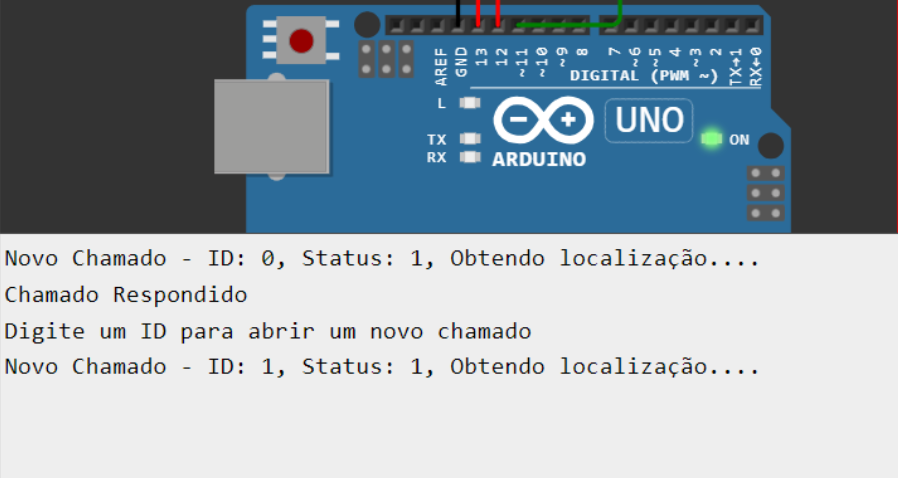
<p>Fonte: elaborada pelos autores.</p>
</div>

&emsp;&emsp;Entretanto, atualmente o protótipo não tem a capacidade de armazenar mais de um chamado em uma array. Isso significa que o sistema só mantém o input mais recente e não é capaz de rastrear vários chamados simultaneamente. Essa limitação será abordada em futuras iterações do sistema para melhorar a capacidade de gerenciar múltiplos chamados.

**Rastreamento de usuários:** <br>

&emsp;&emsp;A simulação do sistema de rastreamento foi estruturada de forma a utilizar um indicador visual, representado por um LED azul, em conjunto com o envio de mensagens ao monitor serial. Esta abordagem foi cuidadosamente escolhida com base nas jornadas de usuário e nas histórias de usuários, destacando-se como um dos principais requisitos essenciais dentro da solução. Isso se deve à necessidade crítica de proporcionar uma experiência eficiente e confiável para os médicos, garantindo que eles possam monitorar e rastrear pacientes de maneira precisa, aprimorando a eficiência dos serviços do Hospital Sírio-Libanês.

&emsp;&emsp;O LED pisca intervalado a cada 2 segundos. Enquanto isso, uma mensagem é enviada ao serial dizendo “Localização obtida”. Assim, é simulado uma atualização constante na posição do usuário da solução dentro do hospital, enquanto um aviso visual é emitido como saída para que seja possível identificar o funcionamento. Nas futuras iterações da solução, a comunicação enviada ao monitor Serial será substituída por um método que permitirá a identificação real da localização, enquanto a sinalização visual continuará a ser realizada pelos LEDs.

<div align="center">
<p>Imagem 20 - Funcionamento do rastreio</p>
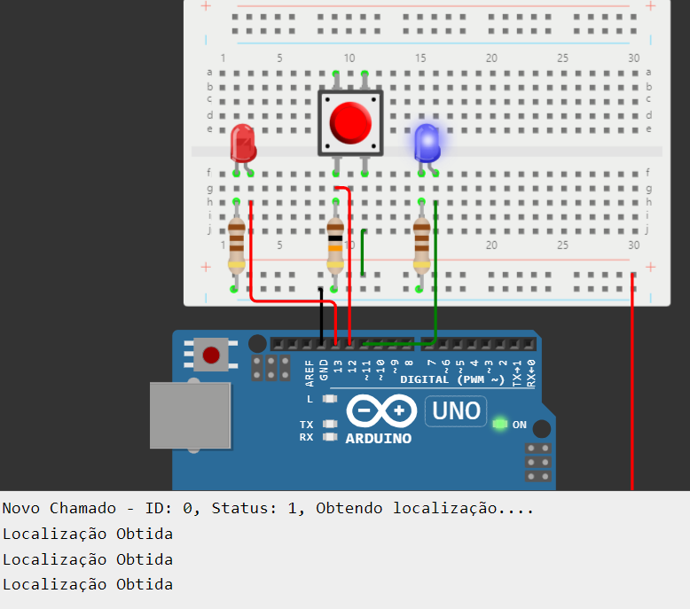
<p>Fonte: elaborada pelos autores.</p>
</div>

&emsp;&emsp;Em versões iniciais do protótipo, enfrentou-se um problema em que ambos os LEDs entravam em conflito devido ao uso de atrasos baseados na função "delay()". Isso prejudicava a continuidade da operação e o intervalo entre os estados do LED não era mantido adequadamente.

&emsp;&emsp;O problema foi resolvido ao substituir os atrasos baseados em “delay()” pelo uso da função “millis()”. O “millis()” é uma função do Arduino que retorna o tempo em milissegundos desde o início do programa, permitindo a criação de atrasos e temporizações mais precisos sem bloquear a execução de outras partes do código, evitando conflitos entre os LEDs e melhorando a eficiência do sistema.

```C++	
unsigned long currentMillisLoc = millis(); // Obtém o tempo atual em milissegundos

// Verifica se o tempo atual é maior que o intervalo de espera definido (2 segundos)
  if (currentMillisLoc - previousMillisLoc >= intervalLoc) {
    previousMillisLoc = currentMillisLoc; // Atualiza o tempo anterior
    ledStateLoc = !ledStateLoc; // Inverte o estado do LED de localização
    digitalWrite(ledPinLoc, ledStateLoc); // Atualiza o LED de localização
```

### 3.4.2. Protótipo Físico do Projeto (offline)

&emsp;&emsp;Um protótipo físico de um projeto se refere a uma representação tangível e concreta de uma parte ou do produto final do projeto. Ele é desenvolvido com o objetivo de testar e validar aspectos físicos, mecânicos ou de design antes da produção final.

&emsp;&emsp;No contexto de uma solução IoT para o Hospital Sírio-Libanês, a aplicação de protótipos físicos é essencial para testar e aprimorar aspectos práticos da implementação. A criação dessas representações tangíveis permite avaliar a usabilidade, a segurança e a integração da solução no ambiente hospitalar. Além disso, a obtenção de resultado de testes contribui para ajustes necessários, assegurando que a solução IoT atenda eficazmente às demandas específicas do parceiro.

&emsp;&emsp;Nesse estágio, é fundamental registrar uma variedade de situações de teste, que englobam exemplos de entradas e saídas geradas pelo sistema físico. Esses registros desempenham um papel crucial na verificação e validação dos componentes do protótipo, pois não se limitam apenas a casos de sucesso, mas também abrangem possíveis falhas nas leituras de entradas e saídas.

&emsp;&emsp;Essa etapa, ao seguir as nomeclaturas e convenções previamente estabelecidas, visa garantir que o protótipo físico funcione conforme o planejado, alinhando-se às necessidades de negócios e à experiência do usuário. Além disso, é apresentado um conjunto de descrições dos testes realizados para fornecer uma compreensão clara do funcionamento do protótipo. Sendo assim, a tabela a seguir servirá como um exemplo valioso para orientar a documentação e ilustrar os resultados obtidos nessa fase do projeto.

**#** | **Descrição** | **Pré-condição** | **Procedimento de teste** | **Pós-condição/Resultado esperado** | **Observações(opcional)**
|----------|----------|----------|----------|----------|----------|
|01|Verificação de conexão de rede Wi-Fi bem-sucedida.| O dispositivo está desligado.| Ligue o dispositivo, aguarde alguns segundos e, então, o LED ficará piscando até estabelecer conexão. | O LED azul indicador de conexão acende de forma contínua, sinalizando uma conexão bem-sucedida à rede. | x 
|02|Envio e recebimento de mensagem entre os dispositivos.| Ambos dispositivos precisão estar conectado a mesma rede Wi-Fi e, também, precisam estar configurados ou como slave, ou como mestre. | Utilizando a biblioteca ESP Now, ligue o dispositivo slave para recebimento da mensagem, enviada através do dispositivo mestre. | A mensagem transmitida aparece no visor, indicando sucesso. | x 
|03|Alcançabilidade da conexão de Wi-Fi. |  O dispositivo precisa estar conectado à uma rede Wi-Fi. | O aparelho foi conectado à uma rede, fazendo com que o LED ficasse permanentemente ligado e, então, o aparelho foi afastado do provedor até o ponto em que o LED voltou a piscar, indicando falha na conexão. | O dispositivo apresentou um ótimo desempenho em uma área considerável | x
|04|Som de notificação para os chamados. | É necessário que a conexão entre um slave e um mestre seja estabelecida. | Os aparelhos foram conectados entre si, para que se comuniquem, e o envio e recebimento de mensagens seja possível. Após a conexão ser estabelecida com sucesso foi acoplado um sensor de som, um buzzer, para que assim ele pudesse emitir um som de notificação de acordo com a urgência do chamado. | O dispositivo apresentou falha nesse caso de teste, o som não foi emitido, logo, foi um caso de falha. É necessário investigar mais a fundo para saber a raiz do nosso problema. | Acreditamos que o som não foi emitido por conta da má configuração do sensor. 

&emsp;&emsp;Após a execução dos casos de teste apresentados na tabela, é possível tirar conclusões valiosas sobre o desempenho do Protótipo Físico. O primeiro caso de teste demonstrou, com sucesso, a capacidade do dispositivo de estabelecer uma conexão de rede Wi-Fi, indicada pelo LED azul que permanece aceso continuamente.

&emsp;&emsp;No segundo cenário, que envolveu o envio e recebimento de mensagens entre dispositivos, a utilização da biblioteca ESP Now foi eficaz. Sendo assim, a comunicação entre o dispositivo mestre e o dispositivo slave foi bem-sucedida. A mensagem transmitida foi recebida conforme esperado, comprovando a funcionalidade do sistema.

&emsp;&emsp;A avaliação da alcançabilidade da conexão Wi-Fi, abordada no terceiro caso de teste, revelou a capacidade do dispositivo em manter uma conexão estável dentro de uma área considerável. O LED que sinaliza a conexão permaneceu estável até o ponto em que o dispositivo foi afastado do provedor, momento em que a falha na conexão foi indicada pela instabilidade no LED, que voltou a piscar.

&emsp;&emsp;O caso de teste de notificação, realizado como o quarto teste, indica a necessidade de ajustes mais refinados e precisos para garantir que todo o sistema funcione de maneira precisa e eficiente. Isso é essencial para assegurar um produto livre de falhas em seu uso. O componente BUZZER requer uma análise mais aprofundada para identificar e corrigir suas falhas, assegurando assim seu funcionamento adequado e integração perfeita ao nosso sistema.

&emsp;&emsp;Durante e após a realização dos quatro casos de teste, foram notadas áreas cruciais para realização de melhorias, garantindo, assim, um desempenho notável do dispositivo ao fim do projeto. A análise abrangente desses resultados é fundamental para aprimorar o protótipo físico, garantindo sua robustez e confiabilidade em diferentes situações de uso.

Link para o vídeo dos testes documentados acima, clique <a href="https://www.youtube.com/watch?v=lV7quwDg7XM">aqui</a>

### 3.4.3. Protótipo do Projeto com MQTT e I2C	

&emsp;&emsp;O protocolo MQTT é amplamente utilizado em soluções IoT para facilitar a comunicação entre dispositivos, sendo uma opção confiável, segura e praticamente livre de falhas, tornando-se a escolha ideal para o nosso projeto. Em termos de funcionamento, o processo desenrola-se da seguinte maneira: temos um publisher, responsável por emitir dados para o dashboard; um subscriber, que captura esses dados e os utiliza no funcionamento do sistema; e um broker, um sistema intermediário que facilita a troca de dados entre o publisher e o subscriber. O grupo Clepius optou por esse protocolo devido à sua baixa taxa de falhas, tornando-o especialmente adequado para ambientes extremos ou com sobrecarga de dados, principalmente porque é comumente utilizado em máquinas de extração de petróleo em desertos isolados. Essas máquinas utilizam esse protocolo para a comunicação entre si e com o sistema, garantindo uma operação eficiente e minimizando falhas em ambientes desafiadores.

&emsp;&emsp;O protocolo I2C opera de maneira distinta em comparação ao MQTT. Nesse contexto, seu funcionamento segue os seguintes passos: conectamos diretamente nosso dispositivo ESP32 ao aparelho LCD, estabelecendo uma ligação direta com o hardware. Em seguida, configuramos as portas de output e input, pois o protocolo I2C baseia-se fundamentalmente em dois tipos de cabos para a transferência de informações: SDA (System Data Line) e SCL (System Clock Line). Essa configuração é realizada em nosso IDE Arduino. O I2C é utilizado para exibir informações recebidas pelo aparelho, proporcionando uma visualização mais rápida e prática dos dados transmitidos. Diferentemente do MQTT, que utiliza um broker para intermediar a comunicação entre os dispositivos, o I2C estabelece uma conexão direta entre o ESP32 e o LCD, simplificando o processo de transferência de informações no contexto do nosso projeto.

&emsp;&emsp;Levando em consideração os desafios apresentados por este projeto, optamos por utilizar ambos os protocolos na construção da nossa solução IoT. O MQTT se destaca na troca eficiente de informações entre o sistema operacional (todos os ESP32) e a comunicação com o dashboard. Por outro lado, o I2C desempenha um papel crucial ao transmitir as informações recebidas pelo ESP32 para a tela LCD, garantindo assim a consistência operacional da solução.

&emsp;&emsp;Esse cenário conversa e atende demandas definidas para a experiência do usuário, por exemplo no **storyboard** definido na imagem 14  deste documento (seção 3.2.2.), que mostra como será a interação da triagem do hospital com a equipe de parada definida.

&emsp;&emsp;Índice para duas palavras específicas utilizadas ao decorrer dessa seção:

&emsp;&emsp;Clephost - Indica o nome do equipamento que fica nos ambientes / salas do hospital para conexão entre médicos e pacientes.

&emsp;&emsp;Clep - Indica o nome do equipamento acoplado aos médicos / pacientes durante o tempo de uso dentro dos ambientes hospitalares.

&emsp;&emsp;Durante o desenvolvimento do projeto, documentamos diversos casos de teste, abrangendo situações de sucesso e falha. Entre eles, destacamos:

| **#** | **Situação de uso** | **Configuração do ambiente** | **Ação do usuário** | **Resposta esperada do sistema** |
|-------|----------------------|------------------------------|----------------------|---------------------------------|
| 1     | **Caso de sucesso:**  Envio de mensagens através da plataforma Ubidots para um Clep.  (PUBLISH) | É necessário que um Clephost esteja configurado no ambiente/sala em questão e que um Clep esteja sendo utilizado por um médico ou integrante da equipe do PA. E, por fim, um computador com acesso à conta do gerenciador do sistema esteja logado no Ubidots. | Médico que esteja carregando um Clep entre na sala/ambiente e seja identificado pelo Clephost, assim, guardando o endereço MAC da placa ESP32. | Diante desse cenário, de acordo com a necessidade do atendimento desse médico, o Ubidots envia uma mensagem ao Clephost e, em seguida, replica-a a todos os Cleps conectados no ambiente. Assim, sendo recebido pelo médico em questão.   **Sucesso** |
| 2     | **Caso de sucesso:**  Conexão entre um Clep e um Clephost | É necessário que um médico e um ambiente estejam com os seus equipamentos em funcionamento e configurados de acordo com o manual de instruções. | Médico entre ou saia de um ambiente, assim, sendo conectado / desconectado pelo Clephost. | O Clep se conecta ou desconecta automaticamente com o Clephost ao entrar na área de conexão ou deixa-la. Utilizamos a biblioteca ESP-Now para realizar essa configuração.   **Sucesso** |
| 3     | **Caso de sucesso:**  Recebimento de mensagens através da plataforma Ubidots para um Clephost → Clep | É necessário que um Clep esteja conectado a um Clephost e o Clephost conectado ao wifi. | O Operador do sistema identifica onde o médico está, analisa dados previamente atualizados na plataforma, e cria um chamado para replicar aos Clep’s conectados nesse ambiente. | O visor LCD recebe os dados enviados pelo ESP32 via o protocolo I2C, assim, conseguindo exibir na tela do equipamento a mensagem que o operador do sistema enviou ao médico.  **Sucesso** |
| 4     | **Caso de falha:**  Conexão intercalada do ESP32 Master entre Ubidots e outros ESP32 Slaves | É necessário que um Clep esteja conectado ao Clephost e o host ao Ubidots, garantindo assim a consistência entre os sistemas. | O operador do Ubidots deve ser capaz de enviar mensagens e receber a partir do protocolo MQTT integrado à biblioteca ESP-Now. | O sistema deve conectar ao ubidots e atualizar os dados adquiridos, após a atualização é necessário que seja desligado por um período de tempo a conexão ao ubidots e seja estabelecida a conexão entre ESP-Master e ESP-Slave para a coleta de dados e recebimento de mensagens do sistema.  **Falhou** |
 
&emsp;&emsp;Plano de solução para casos de falha durante os testes:

&emsp;&emsp;**Caso de falha número 4 -** Atualmente, o grupo está considerando duas abordagens para lidar com esta situação. A primeira consiste em uma solução baseada em software, envolvendo a criação de uma estrutura de código que desative um sistema enquanto o outro estiver ativo, e vice-versa. Isso proporciona uma resolução simples e eficaz para o problema sem a necessidade de adicionar mais peças à solução. A segunda abordagem contempla o uso de duas placas ESP32 com finalidades distintas: A primeira seria dedicada à conexão contínua com o dashboard Ubidots, utilizando o protocolo MQTT, enquanto a segunda estabeleceria a comunicação entre o Master e o Slave. Acreditamos que uma dessas opções nos permitirá resolver o problema de maneira eficaz, sem incorrer em custos elevados para o projeto.

&emsp;&emsp;A documentação das situações de uso para os protocolos MQTT e I2C oferece uma visão abrangente, revelando casos de sucesso e identificando áreas que requerem correções. Essa análise detalhada não apenas fornece insights valiosos sobre a funcionalidade e consistência do sistema, mas também delineia planos de ação para abordar eventuais falhas. Essa abordagem estratégica nos orientará na entrega de um produto isento de falhas ao término do MVP, garantindo a eficácia e confiabilidade da solução proposta.

| Figura | Descrição |
|--------|-----------|
| Figura 21 | A partir da seguinte imagem é possível visualizar o Clephost, aparelho que fica em cada ambiente do hospital, com o led azul aceso, isso indica que há conexões ativas nesse ambiente. |
| Figura 22 | Aqui conseguimos visualizar todos os equipamentos, Clep, conectados ao Clephost por meio do dashboard do Ubidots. |
| Figura 23 | A partir da seguinte imagem é possível visualizar a disposição do equipamento utilizado por médicos dentro do ambiente hospitalar. |
| Figura 24 | Aqui conseguimos visualizar como é feito o envio de mensagens ao equipamento que o médico utiliza, Clep, enviamos o sinal 1 urgência alta, led vermelho. |
| Figura 25 | Confirmação de envio de mensagem ao Clep. |
| Figura 26 | A partir da seguinte imagem é possível visualizar que o equipamento médico, Clep, recebeu a mensagem enviada anteriormente com sucesso. |
| Figura 27 | Aqui realizamos mais um teste para visualizar como é feito o envio de mensagens ao equipamento que o médico utiliza, Clep, enviamos o sinal 2 urgência média, led amarelo. |
| Figura 28 | Confirmação de envio de mensagem ao Clep. |
| Figura 29 | A partir da seguinte imagem é possível visualizar que o equipamento médico, Clep, recebeu a mensagem enviada anteriormente com sucesso. |

<div align="center">
<p>Imagem 21 - Funcionamento do Clephost</p>
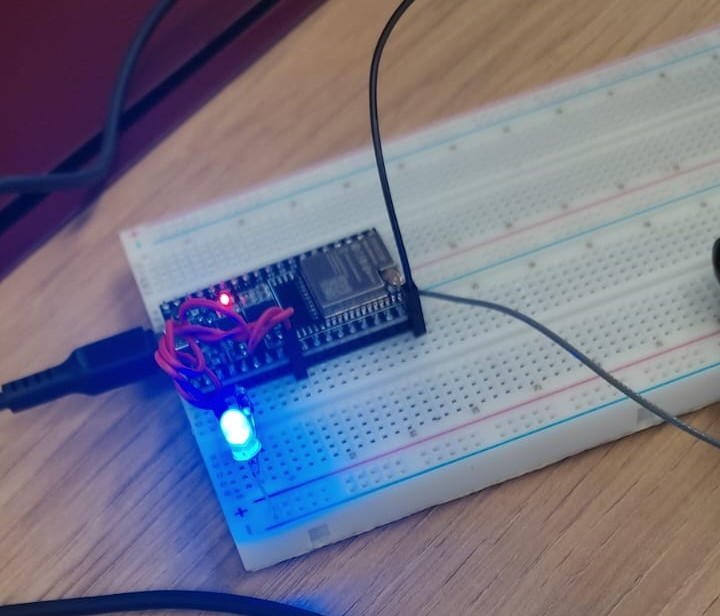
<p>Fonte: elaborada pelos autores.</p>
</div>

<div align="center">
<p>Imagem 22 - Conexões do Clephost visualizadas no dashboard</p>
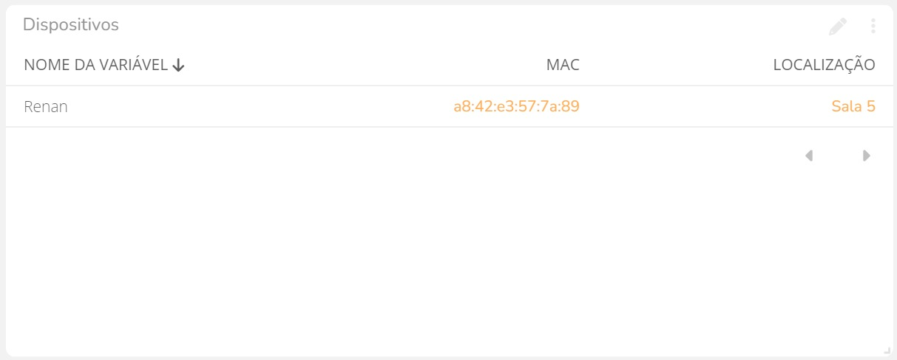
<p>Fonte: elaborada pelos autores.</p>
</div>

<div align="center">
<p>Imagem 23 - Funcionamento do Clep</p>
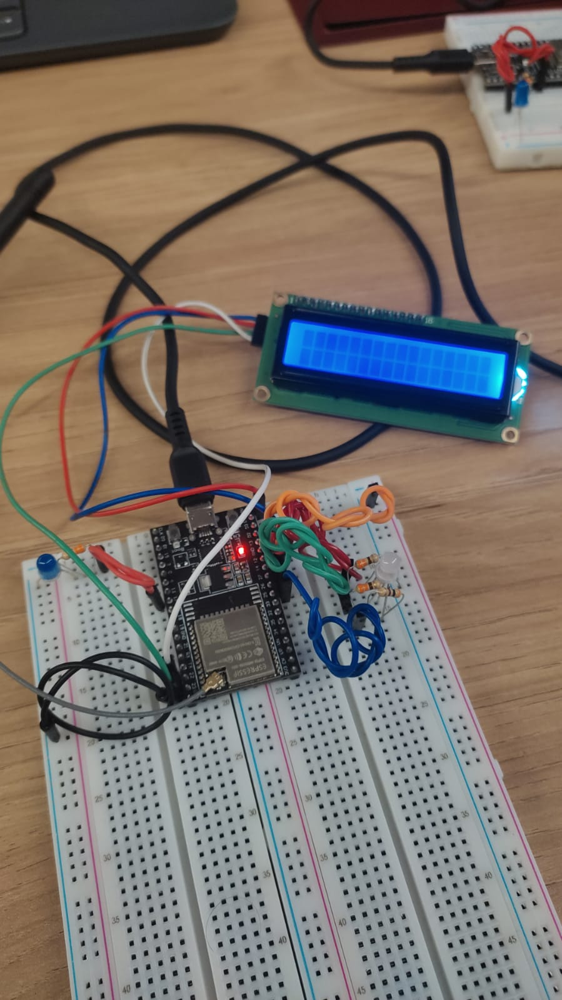
<p>Fonte: elaborada pelos autores.</p>
</div>

<div align="center">
<p>Imagem 24 - Funcionamento do envio de mensgens ao Clep por meio do dashboard</p>
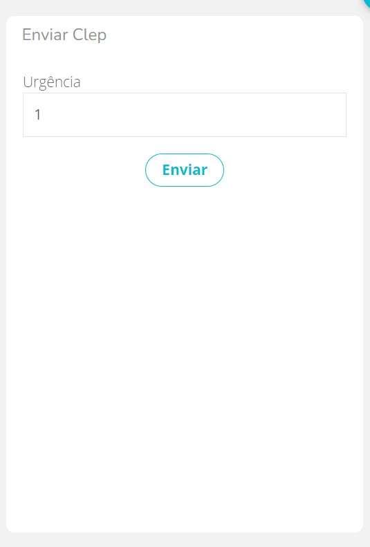
<p>Fonte: elaborada pelos autores.</p>
</div>

<div align="center">
<p>Imagem 25 - Confirmação do envio de mensagens ao equipamento do médico, Clep</p>
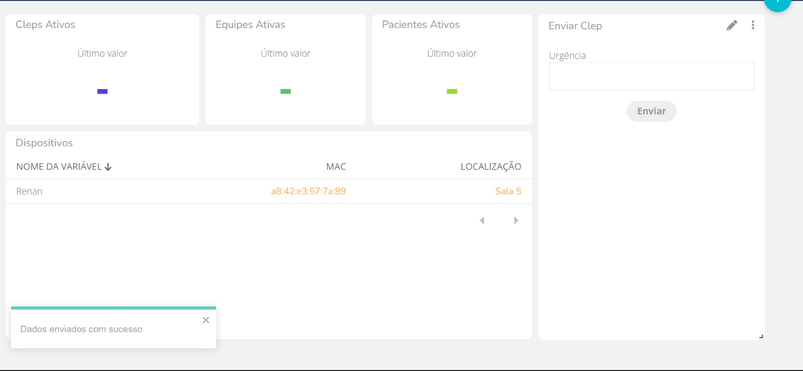
<p>Fonte: elaborada pelos autores.</p>
</div>

<div align="center">
<p>Imagem 26 - Recebimento da mensagem enviada para o equipamento do médico</p>
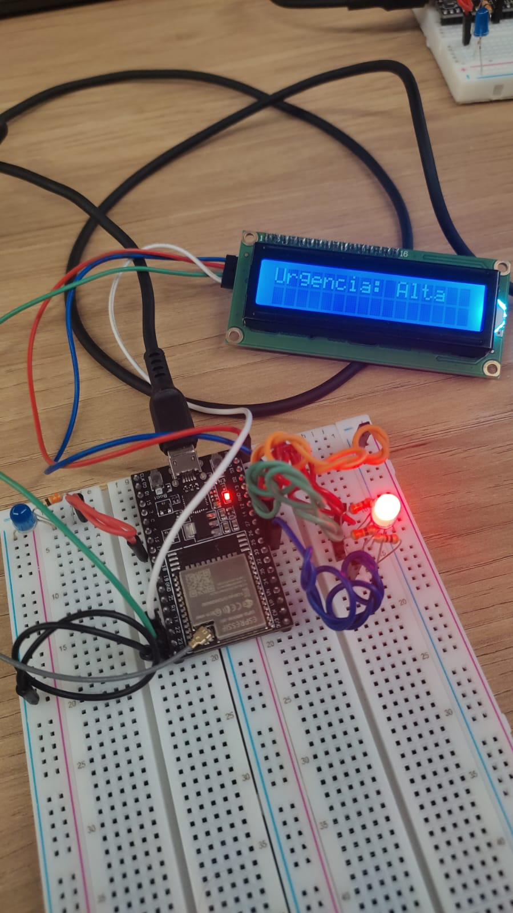
<p>Fonte: elaborada pelos autores.</p>
</div>

<div align="center">
<p>Imagem 27 - Funcionamento do envio de mensgens ao Clep por meio do dashboard</p>
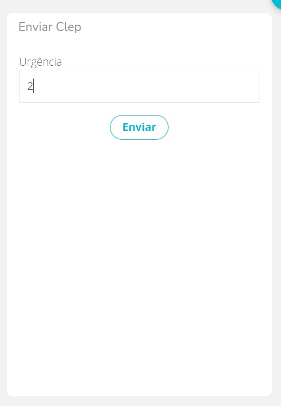
<p>Fonte: elaborada pelos autores.</p>
</div>

<div align="center">
<p>Imagem 28 - Confirmação do envio de mensagens ao equipamento do médico, Clep</p>

<p>Fonte: elaborada pelos autores.</p>
</div>

<div align="center">
<p>Imagem 29 - Recebimento da mensagem enviada para o equipamento do médico</p>
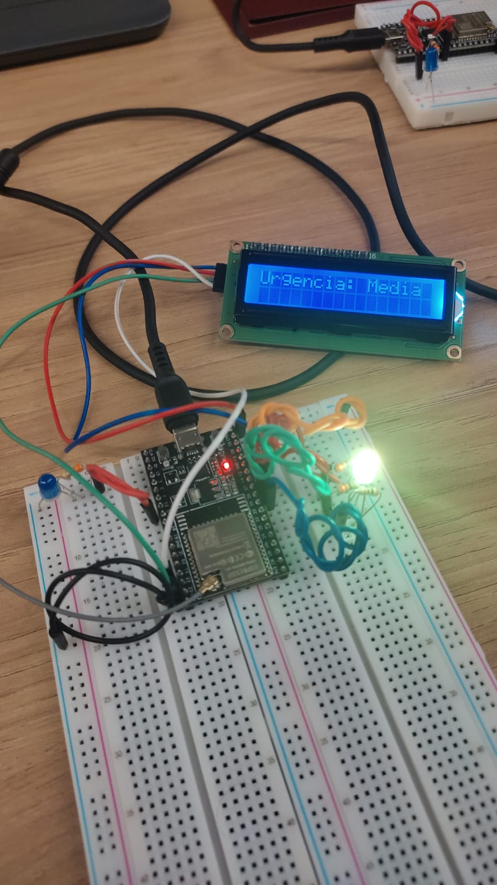
<p>Fonte: elaborada pelos autores.</p>
</div>

### 3.4.4. Protótipo Físico do Projeto (online)

&emsp;&emsp;Para aprofundar nos conceitos presentes no protótipo físico do projeto, é possível entender sobre como os testes realizados na seção 3.4.3. funcionam em relação a arquitetura e ecossistema de códigos do projeto.

&emsp;&emsp;Para isso, foram utilizados diagramas de UML - *Unified Modeling Language*, uma ferramenta visual  que proporciona às equipes uma visão mais abrangente e estruturada de seus fluxos de trabalho. Ao utilizar esse diagrama, as equipes conseguem visualizar de maneira mais clara as etapas envolvidas em seus processos, identificando pontos de conexão e interdependência entre os diversos elementos do sistema. Essa abordagem facilita a compreensão global da solução, contribuindo para uma produção mais eficiente e uma profundo entendimento da arquitetura.

&emsp;&emsp;Dessa maneira, os digramas a seguir se referenciam às funcionalidades do sistema e por meio deles é possível explicar com precisão cada teste realizado, focando a arquitetura em cada usabilidade específica. Para isso, está representado no diagrama a correlação entre diferentes entidades e sua função dentro do código do ecossistema realiza a operação descrita. Os diagramas se completam e abordam todos os contextos de teste, por isso, é encorajado ler o teste e a explicação e voltar no diagrama para entender o ecossistema geral da solução.

<div align="center">
<p>Imagem 30 - Conexão ubidots - esp32 (slave)</p>
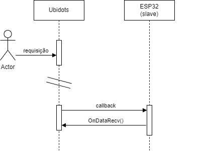
<p>Fonte: elaborada pelos autores.</p>
</div>

&emsp;&emsp;Neste recorte, alguém da equipe de gestão realiza uma requisição através da plataforma Ubidots. Dessa maneira, o ESP32 master procura por um ESP32 slave, caso haja uma falha na conexão, o sistema entra em loop até que ela seja bem estabelecida. Com a conexão funcionando, a informação requisitada pelo usuário é passada pelo sistema e recebida pelo Ubidots.

<div align="center">
<p>Imagem 31 - Conexão ESP32 (master) - ESP32 (slave)</p>
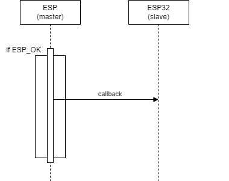
<p>Fonte: elaborada pelos autores.</p>
</div>

&emsp;&emsp;Neste cenário, a função de callback só é realizada caso o ESP esteja conectado. Isso acontece na comunicação e transmissão de informação entre o esp32 master e o esp32 slave. Nesse cenário, essa condição do sistema entra em vigor para registar a localização de microcontroladores relacionados à equipe de parada ou a pacientes.

<div align="center">
<p>Imagem 32 - Conexão e transmissão de informação ESP32(slave) - Ubidots</p>
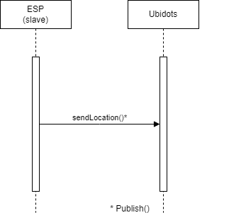
<p>Fonte: elaborada pelos autores.</p>
</div>

&emsp;&emsp;Esse diagrama representa comunicação entre dispositivos da equipe de parada ou pacientes com a interface da solução. Essa comunicação acontece por meio do protocolo de comunicação IoT, o MQTT. 

&emsp;&emsp; Agora que o sistema da solução foi explicado a partit do diagrama de sequência UML, os testes realizados na seção 3.4.3. serão agora  reavaliados sob essa nova perspectiva:

**Teste 1** - Caso de sucesso: Envio de mensagens através da plataforma Ubidots para um Clep.

&emsp;&emsp;Nesse recorte, o sistema deve passar a informação da plataforma Ubidots (dashboard), para uma das placas ESP32 e realizar a ação requisitada.

&emsp;&emsp;Isso acontece por meio das funções:

```C++
OnDataSent();
setupMqtt();
callback();
```
&emsp;&emsp;Elas são responsáveis por conectar por meio de Wi-Fi a plataforma Ubidots com as placas de ESP32 disponíveis. Além disso, possuem mecanismos que permitem passar a informação solicitada, como acender o LED na cor da urgência delimitada:

```C++
else if ((char)payload[0] == '3') {
      digitalWrite(pinRed, LOW);
      digitalWrite(pinGreen, HIGH);
      digitalWrite(pinBlue, LOW);
      lcd_i2c.print("Urgencia: Baixa");
    }
```

&emsp;&emsp;Essa funcionalidade do sistema abrange tópicos significativos em relação ao desenvolvimento do projeto. Isso pode ser relacionado as definições da solução abordadas na Imagem 11 - Mapa de jornada do usuário 03 deste documento, na seção 3.2.2, que explora a possibilidade de um usuário voltado para a gestão hospitalar acionar um médico através da interface ou dashboard.

&emsp;&emsp;Aqui é interessante relembrar que o IoT possui duas saidas informacionais em LEDs: um que mostra a conexão Wi-Fi e outro que permite ao usuário verificar o tipo de urgência através da cor do LED. Esses itens são essenciais de feedback do sistema par o usuário e permite uma melhor usabilidade da solução.

**Teste 2** - Caso de sucesso: Conexão entre um Clep e um Clephost.

&emsp;&emsp;Para iniciar a conexão entre duas placas de ESP32, é necessário entender que esse mecanismo é formado por uma placa "lider" e uma placa "liderada". Dessa maneira, é possível conectar as duas entidades por meio de Wi-Fi e passar informações entre elas por meio de protocolos.

&emsp;&emsp;Como respresentado no diagrama de sequência UML, as placas se conectam usando da biblioteca "ESPNow" e por meio de uma chave-código e um canal de comunicação definido. Isso ocorre no código dessa maneira:

```C++
void configDeviceAP() {
  const char *SSID = "Slave_1";
  // Configura o dispositivo como ponto de acesso com um SSID e senha específicos
  bool result = WiFi.softAP(SSID, "Slave_1_Password", CHANNEL, 0);
  if (!result) {
    Serial.println("AP Config failed.");
  } else {
    Serial.println("AP Config Success. Broadcasting with AP: " + String(SSID));
    Serial.print("AP CHANNEL "); Serial.println(WiFi.channel());
  }
}
```

&emsp;&emsp;Essa conexão é primordial para o bom funcionamento da solução e aborta uma das principais resiquições da solução. É possível observar isso na seção 3.2.4. deste documento, que aborda o protótipo de interface com o usuário e descreve a usabilidade das placas ESP32 em reação a organização de filas de espera.

&emsp;&emsp;Isso acontece porque, pacientes com placas ESP32 mini nas suas pulseiras, possibilitam a conexão com outras placas ESP32 localizadas em diferentes áreas do hospital. Essa funcionalidade configura à solução a identificação da localização em diferentes salas que apresentam suas próprias placas, com suas próprias chaves de identificação.

&emsp;&emsp;O teste a seguir representa um fucionamento ultrapassado do código. Isso acontece porque conforme o projeto foi sendo desenvolvido, algumas funcionalidadees do código foram substituidas por opções mais funcionais. Mesmo assim, o teste 3 será explicado conforme sua lógica desenvolvida:

**Teste 3** - Caso de sucesso: Recebimento de mensagens através da plataforma Ubidots para um Clephost → Clep.

&emsp;&emsp;Nesse teste, foi colocado a prova o funcionamento do envio de informsações no sentido dashboard -> ESP32 (líder) -> ESP32 (liderado). 

&emsp;&emsp;No código do projeto, esse funcionamento usa a comunicação entre ESPs por meio da biblioteca ESPNow, conforme mostrado anteriormente e protocolos MQTT. Já em relação a conexão com a interface, os códigos usados são representado nos seguintes trechos:

&emsp;&emsp;A comunicação com broker usando MQTT, garante a transmição de informações de todo o ecossistema. Nesse contexto, todas as *user stories* e mapas de jornada de usuário são englobados, adicionando a funcionalidade principal da solução. Esses mecanismos de validação da solução estão presentes nas seçõs 3.2.3. (*user stories*) e 3.2.2. jornadas do usuário e *storyboard*.

```
#include "UbidotsEsp32Mqtt.h"
(...)
const char *UBIDOTS_TOKEN = "BBUS-k79VIHwXIgv1c8Tn4JQXSHxlsS0AMB";
(...)
Ubidots ubidots(UBIDOTS_TOKEN);

```
&emsp;&emsp;Essa função específica do projeto é abordada no storyboard 03, que aborda a necessidade de uma persona que representa o usuário da triagem e gestão hospitalar de pacientes e equipes de parada. 

**Teste 4** - Caso de falha: Conexão intercalada do ESP32 Master entre Ubidots e outros ESP32 Slaves.

&emsp;&emsp;O teste número 4 está relacionado a uma falha que ocorreu no setor entre placas ESP32 (líder e liderado) e a dashboard do projeto.

&emsp;&emsp;Para entender melhor essa situação é possível olhar para essa parte do código do projeto, que tenta conectar mútuamente e organicamente os dois tipos de placas e a plataforma de interface do usuário. 

```C++
if (key == 1){
    setupMqtt();
    if (abs(static_cast<long>(millis() - timer)) > PUBLISH_FREQUENCY){
      char macStr[18];
      sprintf(macStr, "%02x:%02x:%02x:%02x:%02x:%02x",
              slave.peer_addr[0], slave.peer_addr[1], slave.peer_addr[2],
              slave.peer_addr[3], slave.peer_addr[4], slave.peer_addr[5]);
      char* context = (char*)malloc(sizeof(char) * 30);
      
      // Adiciona o contexto da variável em formato JSON (chave, valor)  
      ubidots.addContext("id", macStr);
      ubidots.addContext("sala","Sala 5");
      ubidots.getContext(context);

      // Adiciona à variável um valor númerico e o contexto. Em seguida, dá publish no Ubidots
      ubidots.add(VARIABLE_LABEL, 0, context);
      ubidots.publish(DEVICE_LABEL);
      timer = millis();
      ubidots.disconnect();
      key = 0;
    }
  }
```

&emsp;&emsp;Esse trecho específico é responsável por fazer a interligação entre a placa master (líder) e a plataforma "Ubidots", que precisa do formato específico JSON. Porém, o princial desafio nesse contexto é fazer as conexões necessárias para que a comunicação intercalada entre placas líderes e lideradas e a também a plataforma ubidots funcione em diferentes tipo de fluxo, como um ecossistema que passa informações entre diferentes entidades da arquitetura.

&emsp;&emsp;Para solucionar essa falha, é preciso voltar o olhar para os requisitos funcionais do sistema e compreender quais são as delimitações de funcioalidade do projeto. Além disso, complementar no código do projeto funções que permitam a comunicação inter-fluxo entre diferentes entidades e também melhoram a clareza entre arquivos de lógica de programação.

&emsp;&emsp;Esse cenário foi solucionado ao mudar o fluxo de transmissão de informações. Isso aconteceu de maneira que a interface Ubidots passa a informação direto para o ESP32 slave. Dessa forma, a placa master fica responsável por identificar a localização das placas lideradas e toda a comunicação da interface com o IoT é feita direto para os equipamentos das equipes de parada e pacientes.

&emsp;&emsp;Dessa maneira, é necessário complementar as situações de teste, de acordo com o desenvolvimento do projeto.

| **#** | **Situação de uso** | **Configuração do ambiente** | **Ação do usuário** | **Resposta esperada do sistema** |
|-------|----------------------|------------------------------|----------------------|---------------------------------|
| 5     | **Caso de sucesso:** Ao enviar um chamado pela interface Ubidots, um botão físico no projeto é capaz de receber e responder a esse chamado. | É necessário que um Clephost esteja configurado no Wi-fi do local e como token correto da conta do Ubidots em seu código. Por fim, é preciso um computador com acesso à conta do gerenciador do sistema esteja logado no Ubidots. | Usuário responsável pelo gerenciamento do hospital deve acionar o sistema para fazer uma requisição para o clephost mais próximo. | Diante desse cenário, o sistema capta a requisição e envia por Wi-Fi e potocolo MQTT a mensagem. A placa ESP32 entende esses sinais e mostra no visor LCD o chamado, então o médico aceita ou recusa o chamado apertanto um dos botões.  **Sucesso** |
| 6    | **Caso de sucesso:** Visualização de informações e chamados por meio de um visor LCD. | É necessário que uma Placa ESP32 esteja confiurada no sistema e que um visor LCD esteja corretamente ligado. | Um usuário da gestão informa para o sistema onde é o local da emrgÊncia e qual a sua categoria (leve, grave, urgente). | O sistema deve informar no LCD conectado ao ESP32 específico o local e caregoria da urgência.  **Sucesso** |

**Teste 5** - Caso de sucesso: Ao enviar um chamado pela interface Ubidots, um botão físico no projeto é capaz de receber e responder a esse chamado.

&emsp;&emsp;Nesse cenário, o botão que faz a comunicação com o usuário final é de extrema importância. Ele comunica para o sistema o status da requisição e permite o bom funcionamento da solução. Assim, as duas entradas de booleanas que são inseridas no sistema por meio de botões garantem que a solução entenda quando o chamado é atendido ou recusado.

&emsp;&emsp;O trecho que representa a comunicação do sistema com o botão está presente aqui:


```C++
void loop()
{
  buttonState = digitalRead(buttonPin);

  if (millis() - timer > PUBLISH_FREQUENCY) // triggers the routine every 5 seconds
  {
    if (buttonState == 1 && chamadoState == 1)
    {
      char* context = (char*)malloc(sizeof(char) * 30);
      
      // Adiciona o contexto da variável em formato JSON (chave, valor)  
      ubidots.addContext("estado", "Ocupado");
      ubidots.getContext(context);

      ubidots.add(VARIABLE_LABEL, 0); // Insert your variable Labels and the value to be sent
      ubidots.add(VARIABLE_OWNER, 0, context); // Insert your variable Labels and the value to be sent
      ubidots.publish(DEVICE_LABEL);
      timer = millis();

      lcd_i2c.clear();
      lcd_i2c.print("Chamado");
      lcd_i2c.setCursor(0, 1);
      lcd_i2c.print("Respondido");
      chamadoState = 0;
      delay(1000);
    }
  }
  ubidots.loop();
}
```
&emsp;&emsp;Dessa maneira, o cenário defendido no storyboard 01, onde o médico atente a um chamado ao apertar um botão é abordado no ecossistema da solução.


**Teste 6** - Caso de sucesso: Visualização de informações e chamados por meio de um visor LCD.

&emsp;&emsp;Esse teste de usabilidade do sistema faz referêncisa tanto a requisitos funcionais quanto não funcionais da solução. Ao capacitar a solução nesse nível de integração, é garantido ao usuário uma boa qualidade de software, bem como atinge a comunicação entre diferentes partes da solução e permite a formatação de Dados para Protocolo MQTT.

&emsp;&emsp;Dessa maneira, o componente de comunicação serial presente no projeto(LCD), garante uma comunicação com o usuário final do IoT, permitindo visualizações do sistema e transmissão de informações para o ponto final de parada.

&emsp;&emsp;No código, é possível ententer esse funcionamento neste trecho:

```C++
// Inicializa a comunicação I2C e o visor LCD
  Wire.begin(I2C_SDA, I2C_SCL);
  lcd_i2c.init();
  lcd_i2c.backlight();
  lcd_i2c.setCursor(0,0);

(...)

void printLCD(const String& message, const String& room) {
  lcd_i2c.clear();
  // Se a urgência for 1 (Alta), o LED RGB fica vermelho e a mensagem é printada no LCD
  if (message == "1") {
    digitalWrite(pinRed, HIGH);
    digitalWrite(pinGreen, LOW);
    digitalWrite(pinBlue, LOW);
    lcd_i2c.setCursor(0, 0);
    lcd_i2c.print("Urgencia: Alta");
    lcd_i2c.setCursor(0, 1);
    lcd_i2c.print(room);
(...)
}
```

&emsp;&emsp;É interressante se atentar que essa última parte do código se adapta para o tipo de urgência. Dessa maneira, este alerta específico do projeto foi construido de acordo com a regra de negócio do TAPI (Termo de Abertura do Projeto), e confere a solução criada pelo grupo Clepius a realização concreta das *User Stories* previamente mapeadas.

&emsp;&emsp;Em resumo, a integração eficaz de diagramas de sequencia UML e testes do sistema desempenha um papel crucial no desenvolvimento de software de alta qualidade. Os diagramas de sequência oferecem uma representação visual abrangente e compreensível do sistema, proporcionando uma base sólida para a análise, design e implementação. Ao empregar esses diagramas em conjunto com estratégias de teste bem elaboradas, as equipes de desenvolvimento podem garantir a confiabilidade, a escalabilidade e a manutenibilidade de seus sistemas.

&emsp;&emsp;Os testes do sistema, quando integrados de maneira holística com o processo de desenvolvimento, ajudam a identificar e corrigir possíveis falhas, garantindo que o produto final atenda aos requisitos estabelecidos. A utilização de casos de teste derivados diretamente dos artefatos de diagrama assegura uma cobertura abrangente, reduzindo riscos e aumentando a confiança na entrega.

&emsp;&emsp;Portanto, dentro da utilização conjunta de diagramas e testes do sistema, destaca-se principalmente a boa funcionalidade da comunicação do sistema por meio do protocolo MQTT (ubidots -> ESP32 slave). Assim, esse requisito funcional proporciona uma abordagem integrada que promove a qualidade do software, alinhando-se às melhores práticas de desenvolvimento e garantindo a satisfação do usuário final. Este ciclo de desenvolvimento bem estruturado, respaldado por diagramas e testes robustos, não apenas acelera o desenvolvimento, mas também estabelece as bases para sistemas resilientes e duradouros.


### 3.4.5. Protótipo Final do Projeto 

&emsp;&emsp;O protótipo final do projeto aborda todas as diferentes áreas pensadas e desenvolvidas para atenter aos requisitos da solução. Dessa maneira, o produto desenvolvido pela equipe Clepius é capaz de envolver tanto esquipamentos IoT (para pacientes, equipes de parada e placas fixas em cada sala), quanto uma interface interativa para equipes de gestão e toda a tecnologia por trás desse sistema.

**Placas ESP32 (slave e master)**

&emsp;&emsp;As diferentes configurações das placas permitem que exista no sistema  a comunicação entre pontos diverssos do ecossistema e a localização de usuários finais do produto.

<div align="center">
<p>Imagem 33 - Placa ESP32 </p>
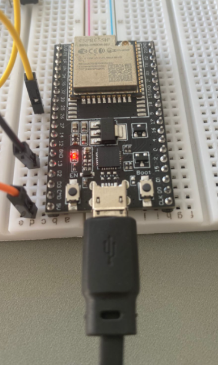
<p>Fonte: elaborada pelos autores.</p>
</div>

&emsp;&emsp;Para os pacientes e médicos, as placas de ESP32 são configuradas como "slave". Por outro lado, as placas fixas em cada sala são configuradas como "master".

&emsp;&emsp;Essa usabilidade do sistema pode ser verificada no diagrama de arquitetura do código do projeto:

<div align="center">
<p>Imagem 34 - Arquitetura </p>

<p>Fonte: elaborada pelos autores.</p>
</div>

&emsp;&emsp;Conforme o diagrama, os dispositivos são conectados ao wi-fi e funcionam da seguinte maneira:

&emsp;&emsp;As placas "slave" se conectam as placas "master" por proximidade. Depois de conectadas, por meio de uma função de callback, a placa master registra a localização configurada na placa "slave", que registra na plataforma "Ubidots" a sua localização.

&emsp;&emsp;Por fim, é importante relembrar os componentes físicos ligados a placa:

- Botão de aceitar chamado;
- Motor de vibração;
- LED RGB;
- LED azul.

<div align="center">
<p>Imagem 35 - Clep:Iot da equipe de parada </p>

<p>Fonte: elaborada pelos autores.</p>
</div>


<div align="center">
<p>Imagem 35 - Placa ESP32 </p>
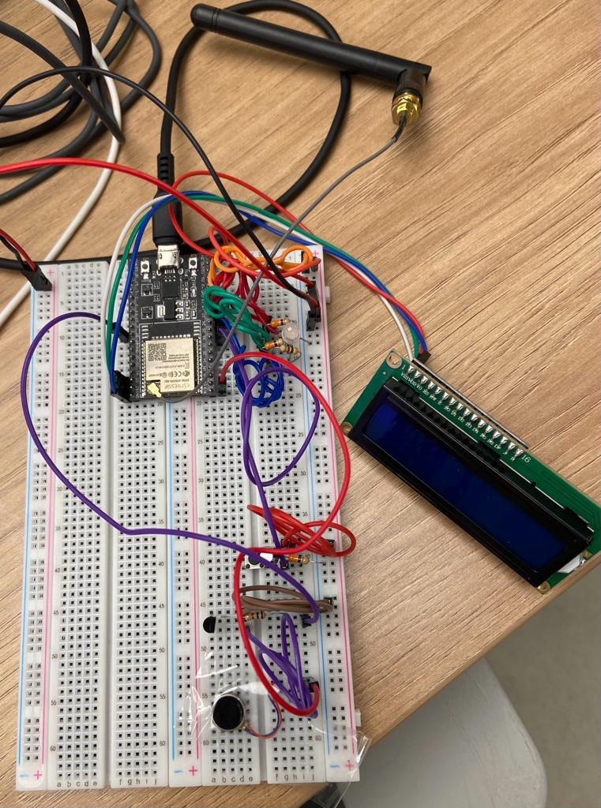
<p>Fonte: elaborada pelos autores.</p>
</div>

&emsp;&emsp;Além disso, a comunicação desse sistema é feita através de Wi-Fi, utilizando a biblioteca do ESP Now, conforme exemplificado no diagrama de sequência:

<div align="center">
<p>Imagem 33 - Diagrama de Sequência </p>
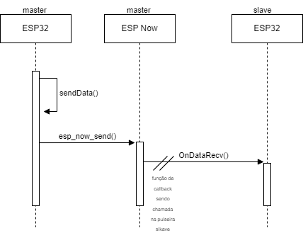
<p>Fonte: elaborada pelos autores.</p>
</div>

**Dashboard**

&emsp;&emsp;Para tornar a comunicação do sistema possível, a interface da locução abrange diferentes tecnologias. Dessa maneira, foi utilizada a tecnologia disponível na plataforma "Ubidots" que simplifica protocolos de comunicação entre equipmentos de internet das coisas.

<div align="center">
<p>Imagem 36 - Dashboard </p>
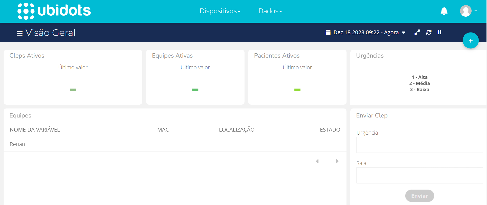
<p>Fonte: elaborada pelos autores.</p>
</div>

&emsp;&emsp;Diante desse cenário, é possível verificar quais são as informações disponíveis nessa etapa da solução. Assim, a visualização simples da localização de "cleps" ativos e pulseiras de pacientes, facilitam o trabalho das equipes de gestão.

&emsp;&emsp;Além disso, é pela interface que o processo de criar um chamado e escolher a categoria de urgência se torna possível. Nesse mesmo contexto, as filas de espera presentes no hospital podem ser gerenciadas por esta interface. 

&emsp;&emsp;É dentro deste recorte do sistema que a comunicação entre ESP32 "slave" se comunica com a dashboard por meio de protocolo MQTT.

**Atualização de Teste**

&emsp;&emsp;Visando a finalização do projeto, foi preciso refazer o teste de falha que será apresentado a seguir. As sugestões da seção 3.4.3. foram adentidas e observadas durante o novo teste 4:

| **#** | **Situação de uso** | **Configuração do ambiente** | **Ação do usuário** | **Resposta esperada do sistema** |
|-------|----------------------|------------------------------|----------------------|---------------------------------|
| 4     | **Caso de sucesso:**  Conexão intercalada do ESP32 Master entre Ubidots e outros ESP32 Slaves | É necessário que um Clep esteja conectado a dashboard e o host ao mesmo Wi-Fi, garantindo assim a consistência entre os sistemas. | O operador do Ubidots deve ser capaz de enviar mensagens e receber a partir do protocolo MQTT  e funções de callback, integrado à biblioteca ESP-Now. | O sistema deve conectar ao ubidots e atualizar os dados adquiridos, após a atualização é necessário que seja desligado por um período de tempo a conexão ao ubidots e seja estabelecida a conexão entre ESP-Master e ESP-Slave para a coleta de dados e recebimento de mensagens do sistema.  **Sucesso** |

Para assistir o vídeo explicativo clique <a href="https://www.youtube.com/watch?v=g1nzbSaWHpM">aqui</a>.


### 3.4.6. Testes de Usabilidade

&emsp;&emsp;Os testes de usabilidade referem-se a um conjunto de procedimentos e avaliações destinados a medir a eficácia, eficiência e satisfação do usuário ao interagir com um sistema, produto ou serviço. Através deles, foi possível testar efetivamente a aplicação antes de sua finalização. Essa prática visa identificar e resolver potenciais obstáculos na experiência do usuário, garantindo que a solução em questão atenda de maneira intuitiva e eficaz às necessidades e expectativas dos usuários finais.

**Contexto onde os testes foram realizados**

&emsp;&emsp;Nossa avaliação ocorreu no Instituto de Tecnologia e Liderança de São Paulo, INTELI, em 13/12/2023. Os próprios desenvolvedores da solução foram os responsáveis pela execução dos testes, sendo os alunos da turma 6 os escolhidos para avaliar nossa solução.

&emsp;&emsp;Na sala de aula e nos grupos de estudo, os estudantes receberam uma contextualização sobre o projeto antes de iniciar os testes. A partir desse momento, eles exploraram a solução de maneiras diversas e sem restrições. Dois membros do grupo observaram atentamente e registraram anotações, enquanto os testadores foram incentivados a explorar a solução desenvolvida pelo grupo Clepius da maneira mais livre possível, sem instruções prévias.

&emsp;&emsp;Diante disso, a abordagem adotada durante os testes de usabilidade proporcionou uma valiosa compreensão sobre a interação dos estudantes com a solução desenvolvida pelo grupo Clepius. A liberdade concedida aos testadores promoveu uma exploração autêntica e reveladora, permitindo-nos obter insights valiosos para aprimorar ainda mais nossa aplicação. Leia as próximas seções atentamente para que seja possível visualizar a proposta descrita acima e entender os resultados em geral.

**Problemas detectados e resultados em geral**

&emsp;&emsp;Durante a condução dos testes de usabilidade, foram observadas algumas questões relacionadas à compreensão do conteúdo pelos usuários. As anotações desses testes levaram à identificação de problemas gerais que merecem atenção e resolução. A tabela a seguir oferece uma visão resumida dessas dificuldades, e uma versão completa pode ser acessada pelo Google Sheets clicando <a href="https://docs.google.com/spreadsheets/d/19aDiepjYHBTZrgGBz_jJwGRVO5xL1slAnIRs4PUF02k/edit?usp=sharing">aqui</a>.

| Tarefa                         | Etapa com dificuldade    | Descrição                                                                                                   | Tester          |
|-------------------------------|---------------|---------------------------------------------------------------------------------------------------------------------|-----------------|
| Enviar chamado de emergência   | Conseguir identificar a aba de envio de chamado no dashboard  | João, ao ler a seção 5.0 do nosso manual de instruçoes teve um pouco de dificulade para identificar a aba de envio de chamados na imagem do nosso dashboard, ele disse que as cores de fundo eram muito claras e isso atrapalhava a visualização. | Tester 3 - João |
| Responder chamado de emergência| Consegue identificar botão para resposta  | Anna, por conta do botão ainda estar sem a iconografia necessária, demorou alguns segundos para identificar como enviar a confirmação. Entretanto, conseguiu identificar corretamente e enviar a resposta ao chamado de forma rápida. | Tester 4 - Anna |
| Obter localização              | Verificar se o paciente em questão está com a localização atualizada  | João, ao ler a seção 5.0 -> 5.3 parágrafo B, não entendeu corretamente onde buscar a localização do paciente, ele emorou um pouco mais do que o restante. Sugeriu talvez usar uma cor mais sgnificativa para marcar a localizção. | Tester 3 - João |

&emsp;&emsp;Nos campos mostrados acima, notou-se uma necessidade de aprimoramento, principalmente na parte de iconografia e disposição de elementos gráficos, onde as melhorias podem ser implementadas para otimizar a experiência do usuário.

&emsp;&emsp;Entretanto, em uma análise geral, os resultados obtidos foram positivos. Todos os participantes conseguiram concluir com sucesso as três tarefas propostas ao término dos testes. Além disso, em totalidade afirmaram que o projeto atende às necessidades dos usuários. Destaca-se que os participantes demonstraram um entendimento abrangente de todas as funcionalidades tanto do protótipo quanto do sistema digital apresentado. Esses indicadores positivos sugerem uma eficácia geral no design e na usabilidade do produto, algo valioso para validar a solução.

&emsp;&emsp;

**Próximos passoas para a correção de possíveis erros e conclusão**

&emsp;&emsp;Os problemas detectados não foram muito críticos; no entanto, será necessário implementar um plano de ação para resolvê-los antes de finalizar a solução. Abaixo, confira os problemas que necessitam de correção e como pretendemos abordá-los:

| Tarefa                         | Severidade    | Suposta Correção                                                                                                   | Tester          |
|-------------------------------|---------------|---------------------------------------------------------------------------------------------------------------------|-----------------|
| Enviar chamado de emergência   | Nível: Alta   | O tester João identificou problemas com as cores do Dashboard. Diante disso, ele sugeriu que colocássemos cores mais significativas em botões importantes e não deixássemos os quadros tão brancos, pois isso atrapalha na visualização do dashboard. | Tester 3 - João |
| Responder chamado de emergência| Nível: Baixa  | A tester Anna não identificou a iconografia do botão que está posicionado na protoboard, dificultando sua resposta em primeiro plano, mas conseguiu utilizá-lo. Ela sugeriu que utilizássemos uma cor verde no botão para torná-lo mais visível para a resposta. | Tester 4 - Anna |
| Obter localização              | Nível: Baixa  | O teste João teve dificuldades novamente ao identificar as cores presentes no quadro dentro do Dashboard. Ele sugeriu que aumentássemos a letra da coluna "localização" e a identificássemos com uma cor mais chamativa. | Tester 3 - João |

&emsp;&emsp;Ao analisar os problemas descritos acima, torna-se evidente a existência de pontos de melhoria cruciais em nossa solução. As sugestões dos testadores fornecem insights valiosos para aprimorar a usabilidade e a eficácia do sistema. Diante dessas considerações, a implementação de ajustes nas cores, iconografia e visibilidade dos elementos no Dashboard emerge como uma prioridade. Estas melhorias não apenas resolverão os desafios identificados, mas também contribuirão significativamente para uma experiência do usuário mais intuitiva e eficiente.


## <a name="c4"></a>4. Possibilidades de Descarte

&emsp;&emsp;A abordagem responsável ao descarte de dispositivos eletrônicos é crucial para mitigar os impactos negativos no meio ambiente e na saúde humana, pois o método de descarte adequado visa minimizar a liberação de substâncias tóxicas provenientes de componentes eletrônicos, reduzir a contaminação ambiental e promover a recuperação de materiais valiosos para reutilização. Ao adotar práticas conscientes, como a separação de componentes para reciclagem, encaminhamento a centros especializados - indicados no documento proveniente de informações coletadas no site da [Companhia Ambiental do Estado de São Paulo](https://cetesb.sp.gov.br/) - e a promoção da reutilização sempre que possível, contribuímos para a sustentabilidade e gestão eficiente de resíduos eletrônicos. Este processo não apenas atende às regulamentações ambientais locais - referenciadas no texto com base na [Assembleia Legislativa do Estado de São Paulo](https://www.al.sp.gov.br/) -, mas também incentiva uma abordagem mais holística em direção a uma economia circular, onde os recursos são preservados e utilizados de maneira eficiente ao longo do ciclo de vida dos dispositivos eletrônicos.

### <a></a>Materiais Utilizados
&emsp;&emsp;O MVP IoT incorpora diversos componentes, cada um com suas características específicas de descarte. Abaixo estão os principais materiais utilizados:

- Módulo ESP WROOM 32U
  - Componentes eletrônicos, placas de circuito impresso, conectores e embalagens de plástico.

- LED RGB;
  - Componentes eletrônicos e plásticos.

- LED Azul;
  - Componentes eletrônicos e plásticos.

- Conectores;
  - Metais e plásticos.

- Botões;
  - Componentes eletrônicos e plásticos

- Visor LCD;
  - Componentes eletrônicos, vidro e plásticos.

- Motor de Vibração
  - Metais e plásticos.

### <a></a>Métodos de Descarte

#### <a></a>&emsp;&emsp; Módulo ESP WROOM 32U, LED RGB, LED Azul, Botões e Visor LCD

&emsp;&emsp;Devido à presença de componentes eletrônicos, o descarte deve ser realizado em instalações de reciclagem de eletrônicos, pois esses centros possuem os recursos necessários para desmontar, reciclar e descartar adequadamente os materiais, minimizando os impactos ambientais.

### <a></a>&emsp;&emsp;Plásticos e Materiais Não Metálicos

#### <a></a>&emsp;&emsp;Embalagens de Plástico, Invólucros de LEDs e Partes Plásticas dos Botões e Visor LCD

&emsp;&emsp;Separe esses materiais para reciclagem em centros de coleta de plásticos. Também, verifique com os serviços de reciclagem locais para garantir que os plásticos sejam processados corretamente. 

### <a></a>&emsp;&emsp;Metais

### <a></a>&emsp;&emsp;Conectores e Componentes Metálicos do Motor de Vibração:

&emsp;&emsp;Encaminhe os componentes metálicos para centros de reciclagem de metais autorizados, garantindo que os metais sejam reciclados de acordo com as normas ambientais locais.

## <a></a>Vida Útil dos Materiais

&emsp;&emsp;A vida útil dos materiais varia conforme o componente:

| **#** | **Componentes** | **Vida Útil** | **Consequência do Descarte Incorreto** |
|-------|------------------|----------------|-----------------|
| 1     | ESP WROOM 32U | 5 anos | Contaminação do solo e da água e risco à saúde |
| 2     | LED RGB | 5 anos | Contaminação do solo e da água e degradação ambiental |
| 3     | LED Azul | 5 anos | Contaminação do solo e da água e degradação ambiental |
| 4     | Botões | 5 anos | Contaminação do solo e da água e degradação ambiental |
| 5     | Visor LCD | 5 anos | Contaminação do solo e da água, degradação ambiental e risco à saúde |
| 5     | Motor de Vibração | 5 anos (depende da frequência de uso, geralmente excedendo o tempo médio) | Contaminação do solo e da água e risco à saúde

## <a></a>Risco de Descarte Incorreto
&emsp;&emsp;O descarte inadequado desses componentes pode resultar em:

### <a></a>Contaminação Ambiental:
&emsp;&emsp;Substâncias tóxicas presentes nos componentes eletrônicos podem contaminar o solo e a água, comprometendo ecossistemas locais.
### <a></a>Contaminação Ambiental:
&emsp;&emsp;Substâncias tóxicas presentes nos componentes eletrônicos podem contaminar o solo e a água, comprometendo ecossistemas locais.

### <a></a>Degradação Ambiental:
&emsp;&emsp;Resíduos plásticos não recicláveis podem levar à degradação ambiental, impactando negativamente a fauna e flora locais.

### <a></a>Riscos à Saúde Humana:
&emsp;&emsp;Manuseio inadequado pode resultar em riscos à saúde devido a substâncias tóxicas presentes nos componentes eletrônicos.

## <a></a>Regulamentações Locais e Normas Ambientais
&emsp;&emsp;Pensando no contexto de local do parceiro, as leis de São Paulo que regem e instruem o cidadão a realizar o descarte correto são:

- De acordo com a ALESP (Assembleia Legislativa do Estado de São Paulo),  a Lei N° 464, de 2009, tem como objetivo criar normas legais para o tratamento dos resíduos provenientes de equipamentos de informática e de telecomunicações;
- Ainda de acordo com a ALESP, a Lei N° 13.576 de 2009, institui normas e procedimentos para a reciclagem, gerenciamento e destinação final de lixo tecnológico;
- De acordo com o Portal da Câmara de Deputados, em 2010, a Lei 12.305 (Política Nacional de Resíduos Sólidos - PNRS) que trata sobre a regularização do descarte de resíduos eletrônicos e faz com que seja instituída a PNRS, foi instituída.

## <a></a>Instruções de Descarte para Usuários Finais
&emsp;&emsp;Ao encaminhar os dispositivos ao final de sua vida útil:

1. Centro de Reciclagem de Eletrônicos:

    Incentiva-se aos usuários a utilizar centros de reciclagem de eletrônicos para garantir o descarte apropriado dos componentes eletrônicos.

2. Pontos de Coleta de Plásticos e Metais:
    Os usuários devem separar os materiais não metálicos e metálicos para reciclagem em pontos de coleta apropriados.

3. Evitar Descartes em Aterros Sanitários:

    O descarte em aterros sanitários pode ser muito prejudicial por conta da liberação de substâncias tóxicas (como mercúrio, chumbo e outros metais pesados), também pela liberação de gases tóxicos e pela incompatibilidade de se decompor, sendo necessário processos de reciclagem.

4. Descarte Local: 
A CETESB - Companhia Ambiental do Estado de São Paulo - é a agência do Governo do Estado de São Paulo responsável pelo controle, fiscalização, monitoramento e licenciamento de atividades geradoras de poluição, com a preocupação fundamental de preservar e recuperar a qualidade das águas, do ar e do solo; sendo assim, fundado em 2020, o Programa Descarte Green tem como objetivo espalhar pontos fixos de coleta de eletrônicos e eletrodomésticos para que o processo de reciclagem seja completado. 
Alguns dos principais pontos de coleta na Grande São Paulo:

  - SECRETARIA DO MEIO AMBIENTE/CETESB
  - Parque Ibirapuera - Av. Pedro Álvares Cabral
  - SESC - Itaquera - Av. Fernando do Espírito Santo Alves de Mattos, 1000
  -  SESC - Interlagos - Av. Manuel Alves Soares, 1100
  - PARQUE DO POVO - Avenida Henrique Chamma, 590 
  - PREFEITURA DA CIDADE DE SÃO PAULO- Viaduto do Chá,15 
  - SECRETARIA MUNICIPAL DO VERDE E MEIO AMBIENTE- Rua do Paraíso, 387


## <a name="c5"></a>5. Conclusões e Recomendações

&emsp;&emsp;O protótipo desenvolvido pelo grupo Clepius para o controle do fluxo de pacientes e atendimentos no Hospital Sírio-Libanês, utilizando uma solução baseada em Internet das Coisas (IoT), demonstrou atender de maneira eficaz aos objetivos estabelecidos no projeto.  Em relação aos princípios e missões da Alma e do Hospital Sírio-Libanês, existe uma compreensão profunda das necessidades do parceiro, focando na busca pela excelência no atendimento médico, na eficiência operacional e na promoção da qualidade de vida dos pacientes.

&emsp;&emsp;Nesse cenário, a proposta de monitoramento em tempo real da identidade, localização e permanência de pacientes e equipes assistenciais no hospital mostra-se alinhada aos objetivos gerais e específicos definidos no início do projeto (seção 1). Além disso, os benefícios esperados, como a otimização do fluxo hospitalar, a resposta rápida em situações de emergência e a gestão eficiente baseada em dados precisos, estão alinhados com as demandas e necessidades identificadas durante a análise do problema. Também, a otimização da alocação de recursos, facilitada pela coleta de dados via sensores e pela formatação eficiente para o protocolo MQTT (conexão com o interface da solução), revela uma abordagem proativa na gestão hospitalar. Ademais, a divisão da solução em três pilares, envolvendo equipamentos IoT para equipes de parada e pacientes, além de um software para a gestão hospitalar, demonstra uma abordagem abrangente e integrada.

&emsp;&emsp;Os requisitos funcionais (RFs) delineados destacam a atenção meticulosa aos detalhes práticos, como a conexão Wi-Fi constante, a definição cuidadosa da chave de identificação do usuário e a representação gráfica dos dados. Esses elementos não apenas aprimoram a funcionalidade da solução "Clepius" mas também garantem uma operação segura e eficiente no ambiente hospitalar dinâmico. Já os requisitos não funcionais (RNFs) reforçam a importância da eficiência de desempenho, segurança, usabilidade e confiabilidade, fundamentais em situações críticas. A consideração da manutenibilidade e portabilidade demonstra uma visão abrangente para a evolução contínua do sistema, alinhando-se às demandas tecnológicas em constante mudança.

&emsp;&emsp;A arquitetura do protótipo, com base no Modelo de Referência para Open Distributed Processing (RM-ODP), destaca a integração eficiente de tecnologias-chave, como os microcontroladores ESP32 e o protocolo MQTT, não apenas oferecendo uma visão prática da infraestrutura, mas também ressaltando a adaptabilidade e eficácia do sistema distribuído proposto.

&emsp;&emsp;A recomendação da implementação da solução "Clepius" no Hospital Sírio-Libanês, se deve a sua capacidade única de resposta rápida a situações emergenciais, otimização na alocação de recursos e aprimoramento geral da eficiência hospitalar. Porém, para que o novo sistema funcione com êxito, considera-se a aplicação de treinamentos personalizados direcionados às equipes do hospital para garantir uma transição suave para a nova solução. Da mesma maneira, recomendações futuras incluem a expansão do uso da tecnologia IoT para outras áreas do hospital, a integração de mais dados e variáveis para análises mais abrangentes, e a consideração de feedback contínuo de pacientes e equipes para refinamento constante do sistema. 

&emsp;&emsp;Outrossim, a adaptação do protótipo para incorporar avanços tecnológicos e mudanças nas práticas hospitalares ao longo do tempo é essencial para manter a relevância e eficácia da solução. Assim, realizar testes com base nos que foram realizados, descritos nas seções 3.4.4 e 3.4.5, é possível identificar que a análise contínua dos indicadores chave de desempenho, como o tempo de espera no pronto atendimento, o tempo de resposta da equipe em emergências e a taxa de incidentes relacionados a atrasos, será crucial para aprimorar a eficácia da solução.

&emsp;&emsp;Ademais, para informações complementares, há disponibilidade de materiais extras, como manuais detalhados de operação, guias de implementação e casos de uso específicos e manuseio correto para o descarte, contribuindo para a compreensão abrangente da solução "Clepius" e facilitando a integração bem-sucedida no ambiente hospitalar.

&emsp;&emsp;O projeto "Clepius" não apenas atende às necessidades atuais do Hospital Sírio-Libanês, mas também se posiciona como uma solução estratégica e adaptável para o gerenciamento hospitalar, combinando inovação tecnológica, colaboração estratégica e uma compreensão profunda das necessidades específicas do setor de saúde, reforçando a robustez e a eficácia desta proposta. Este projeto não é apenas uma resposta às exigências do parceiro, mas também uma visão orientada para o futuro que se alinha às tendências emergentes da tecnologia e às demandas dinâmicas do ambiente hospitalar.

## <a name="c6"></a>6. Referências

Disponível em: <https://www.canva.com/design/DAFxifgpJPc>. Acesso em 17 out 2023.

Disponível em: <https://www.autocorerobotica.com.br/>. Acesso em: 25 ou 2023.

Disponível em <https://www.hospitalsiriolibanes.org.br/>. Acesso em 15 out 2023.

Disponível em <https://alma.hsl.org.br/>. Acesso em 15 out 2023.

Disponível em <https://iso25000.com/index.php/en/iso-25000-standards/iso-25010> Acesso em 1 out 2023


SINCLAIR, Bruce. IoT: Como Usar a "Internet das Coisas" Para Alavancar Seus Negócios. Autêntica Business: 1ª edição (27 junho 2018).<br>

LUCK, Heloisa. Liderança em gestão escolar. 4. ed. Petrópolis: Vozes, 2010. <br>

